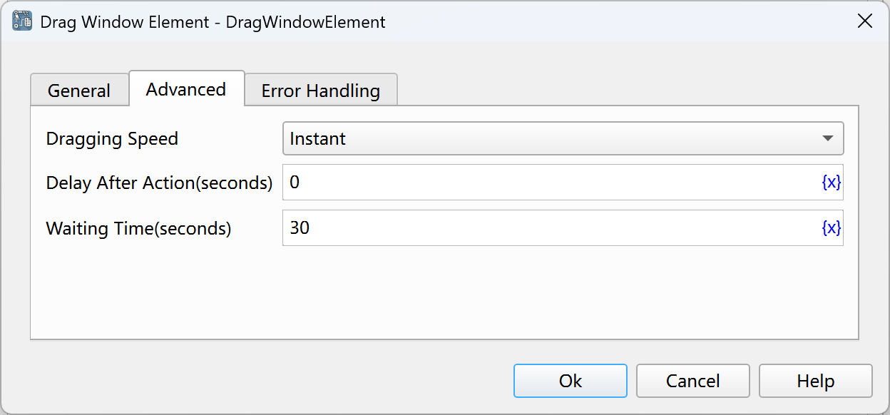

# Drag Window Elements

Simulate the operation of dragging window elements with the mouse.

## Instruction Configuration

### Dragging Element

Select a window element from the element library, or click the "Capture Element" button to call the tool to obtain it. For details, please refer to [Window Element Capture Tool](../../../manual/window_element_capture_tool.md).

### Offset of Dragging Element

By default, the starting position of the mouse is at the center of the element. If checked, the offset of the starting position relative to the upper-left corner of the element can be set.

### X-coordinate Offset of Dragging Element

The X-axis offset of the starting position of the mouse relative to the upper-left corner of the element, in pixels. If it is 0, it is offset to the center of the element by default.

### Y-coordinate Offset of Dragging Element

The Y-axis offset of the starting position of the mouse relative to the upper-left corner of the element, in pixels. If it is 0, it is offset to the center of the element by default.

### Dragging Method

Select the dragging method. The optional values are: drag onto the target element, drag by a specified offset.

### Target Element

Select a window element from the element library, or click the "Capture Element" button to call the tool to obtain it. For details, please refer to [Window Element Capture Tool](../../../manual/window_element_capture_tool.md).

### Coordinate Offset of Target Element

When dragging onto the target element, by default, the ending position of the mouse is at the center of the target element. If checked, the offset of the ending position relative to the upper-left corner of the target element can be set.

### X-coordinate Offset of Target Element

The X-axis offset of the ending position of the mouse relative to the upper-left corner of the target element, in pixels. If it is 0, it is offset to the center of the element by default.

### Y-coordinate Offset of Target Element

The Y-axis offset of the ending position of the mouse relative to the upper-left corner of the target element, in pixels. If it is 0, it is offset to the center of the element by default.

### X-coordinate Offset of Dragging

When the dragging method is selected as dragging by a specified offset, enter the X-axis offset of the ending position of the mouse relative to the starting position, in pixels.

### Y-coordinate Offset of Dragging

The Y-axis offset of the ending position of the mouse relative to the starting position, in pixels.

### Dragging Speed

Select the dragging speed. The optional values are: instant, fast, medium, slow.

### Waiting Time

The time to wait for the web page element to appear, in seconds.

### Error Handling

If an error occurs during the execution of the instruction, error handling will be performed. For details, see [Error Handling of Instructions](../../../manual/error_handling.md).