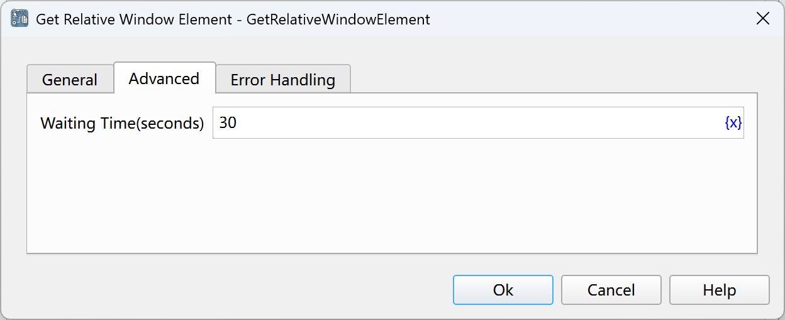

# Obtain Related Window Elements

Obtain the related elements of a specified window element.

## Instruction Configuration

### Window Element

Select a window element from the element library, or click the "Capture Element" button to invoke the tool for acquisition. For details, please refer to [Window Element Capture Tool](../../../manual/window_element_capture_tool.md).

### Positioning Type

Select the positioning type of the related element. The optional values are: parent element, previous sibling element, next sibling element, first matching descendant element, all matching descendant elements, all child elements, child element at a specified position.

### Relative XPath of Descendant Elements

If the positioning type is selected as the first matching descendant element or all matching descendant elements, a relative XPath for matching the descendant elements needs to be entered.

In addition to manually entering the XPath, you can also click the "Obtain Relative XPath" button to invoke the tool for acquisition. For details, please refer to [Window Element Relative XPath Tool](../../../manual/window_element_relative_xpath_tool.md).

### Position of Child Element

If the positioning type is selected as the child element at a specified position, the position of the element to be located in the parent element needs to be entered, starting from 0.

### Found Elements

Enter the process variable used to save the found element or list of elements.

### Waiting Time

The time to wait for the specified web page element to appear, in seconds.

### Error Handling

If an error occurs during the execution of the instruction, error handling will be performed. For details, see [Error Handling of Instructions](../../../manual/error_handling.md).