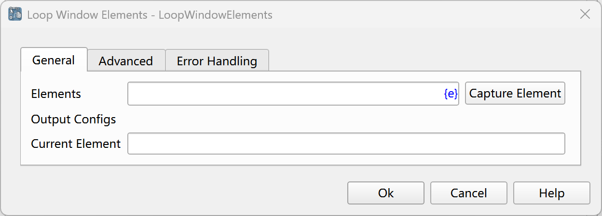
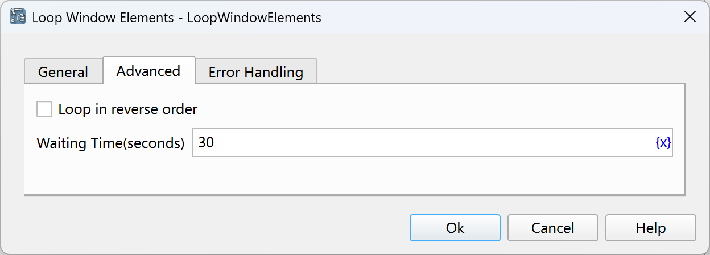

# Traverse Window Elements

Loop through multiple window elements and then execute the instructions within the loop.

## Instruction Configuration

### Element Set

Select a list of similar elements from the element library, or click the "Capture Element" button to call the tool for acquisition. For details, please refer to [Window Element Capture Tool](../../../manual/window_element_capture_tool.md).

### Current Element

Enter the variable name used to save the currently traversed element for use in subsequent instructions.

### Reverse Traversal

Select whether to traverse in reverse order.

### Waiting Time

The time to wait for the window element to appear, in seconds.

### Error Handling

If an error occurs during the execution of the instruction, error handling will be performed. For details, see [Error Handling of Instructions](../../../manual/error_handling.md).