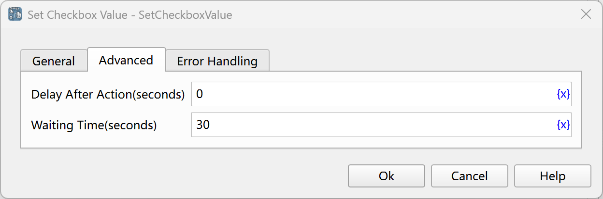

# Set Checkbox Value

Check or uncheck the checkbox.

## Instruction Configuration

### Checkbox Element

Select a checkbox element from the element library, or click the "Capture Element" button to use the tool to obtain it. For details, please refer to [Window Element Capture Tool](../../../manual/window_element_capture_tool.md).

### Selection Method

Select the method of checking the checkbox. The available values are: Check, Uncheck, Invert Selection.

### Delay After Action

After executing the instruction, delay for a period of time before continuing to execute the subsequent instructions. The unit is seconds.

### Waiting Time

The time to wait for the input box to appear. The unit is seconds.

### Error Handling

If an error occurs during the execution of the instruction, perform error handling. For details, see [Error Handling of Instructions](../../../manual/error_handling.md).