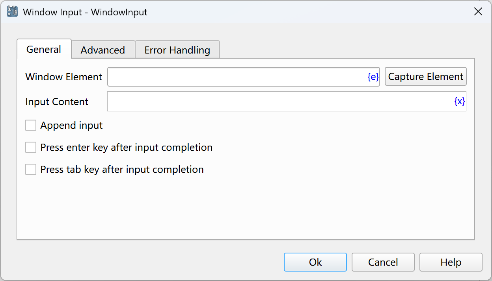

# Window Input

Fill the input box in the window.

## Instruction Configuration

### Window Element

Select an input box element from the element library, or click the "Capture Element" button to call the tool to obtain it. For details, please refer to [Window Element Capture Tool](../../../manual/window_element_capture_tool.md).

### Input Content

Enter the content to be filled.

### Append Input

If checked, append the input content to the original input content; otherwise, overwrite the original input content.

### Press Enter Key After Input Completion

If checked, press the Enter key after the input is completed.

### Press Tab Key After Input Completion

If checked, press the Tab key after the input is completed.

### Input Method

Select the input method:
* Simulate Human Input: Simulate the way of manual input.
* Automated Interface Input: Call the automated interface for input.

### The Input Content Contains Shortcut Keys

If checked, shortcut keys can be included in the input content.

The available virtual keys are as follows:

    {SCROLLLOCK}, {VK_SPACE}, {VK_LSHIFT}, {VK_PAUSE}, {VK_MODECHANGE},
    {BACK}, {VK_HOME}, {F23}, {F22}, {F21}, {F20}, {VK_HANGEUL}, {VK_KANJI},
    {VK_RIGHT}, {BS}, {HOME}, {VK_F4}, {VK_ACCEPT}, {VK_F18}, {VK_SNAPSHOT},
    {VK_PA1}, {VK_NONAME}, {VK_LCONTROL}, {ZOOM}, {VK_ATTN}, {VK_F10}, {VK_F22},
    {VK_F23}, {VK_F20}, {VK_F21}, {VK_SCROLL}, {TAB}, {VK_F11}, {VK_END},
    {LEFT}, {VK_UP}, {NUMLOCK}, {VK_APPS}, {PGUP}, {VK_F8}, {VK_CONTROL},
    {VK_LEFT}, {PRTSC}, {VK_NUMPAD4}, {CAPSLOCK}, {VK_CONVERT}, {VK_PROCESSKEY},
    {ENTER}, {VK_SEPARATOR}, {VK_RWIN}, {VK_LMENU}, {VK_NEXT}, {F1}, {F2},
    {F3}, {F4}, {F5}, {F6}, {F7}, {F8}, {F9}, {VK_ADD}, {VK_RCONTROL},
    {VK_RETURN}, {BREAK}, {VK_NUMPAD9}, {VK_NUMPAD8}, {RWIN}, {VK_KANA},
    {PGDN}, {VK_NUMPAD3}, {DEL}, {VK_NUMPAD1}, {VK_NUMPAD0}, {VK_NUMPAD7},
    {VK_NUMPAD6}, {VK_NUMPAD5}, {DELETE}, {VK_PRIOR}, {VK_SUBTRACT}, {HELP},
    {VK_PRINT}, {VK_BACK}, {CAP}, {VK_RBUTTON}, {VK_RSHIFT}, {VK_LWIN}, {DOWN},
    {VK_HELP}, {VK_NONCONVERT}, {BACKSPACE}, {VK_SELECT}, {VK_TAB}, {VK_HANJA},
    {VK_NUMPAD2}, {INSERT}, {VK_F9}, {VK_DECIMAL}, {VK_FINAL}, {VK_EXSEL},
    {RMENU}, {VK_F3}, {VK_F2}, {VK_F1}, {VK_F7}, {VK_F6}, {VK_F5}, {VK_CRSEL},
    {VK_SHIFT}, {VK_EREOF}, {VK_CANCEL}, {VK_DELETE}, {VK_HANGUL}, {VK_MBUTTON},
    {VK_NUMLOCK}, {VK_CLEAR}, {END}, {VK_MENU}, {SPACE}, {BKSP}, {VK_INSERT},
    {F18}, {F19}, {ESC}, {VK_MULTIPLY}, {F12}, {F13}, {F10}, {F11}, {F16},
    {F17}, {F14}, {F15}, {F24}, {RIGHT}, {VK_F24}, {VK_CAPITAL}, {VK_LBUTTON},
    {VK_OEM_CLEAR}, {VK_ESCAPE}, {UP}, {VK_DIVIDE}, {INS}, {VK_JUNJA},
    {VK_F19}, {VK_EXECUTE}, {VK_PLAY}, {VK_RMENU}, {VK_F13}, {VK_F12}, {LWIN},
    {VK_DOWN}, {VK_F17}, {VK_F16}, {VK_F15}, {VK_F14}
    
    ~ is an alias for {ENTER}.

Modifier Keys:

* '+' represents the {VK_SHIFT} key, i.e., the Shift key.
* '^' represents the {VK_CONTROL} key, i.e., the Ctrl key.
* '%' represents the {VK_MENU} key, i.e., the Alt key.

Examples of using these modifier keys:

* '^a^c': Input the Ctrl+A and Ctrl+C shortcut keys.
* '+{INS}': Input the Shift+Ins shortcut key.
* '%{F4}': Input the Alt+F4 shortcut key.

In addition, the number of repetitions can be specified for a key, such as '{ENTER 2}' which means pressing the Enter key twice in a row.

The press or release operation can also be specified for a key, such as '{VK_SHIFT down}' which means pressing the Shift key, and '{VK_SHIFT up}' which means releasing the Shift key.

If a special character is to be input as an ordinary character, it needs to be escaped using curly braces.
For example, '{^}a{^}c{%}' will input the content '^a^c%' without pressing the Ctrl and Alt keys.
'{{}ENTER{}}' will input the content '{ENTER}' without pressing the Enter key.

### Click Element Before Input

If checked, click the specified element before input.

### Input Interval

The time interval between inputs, in milliseconds.

### Delay Input After Getting Focus

After getting focus, delay the input for a period of time, in seconds.

### Delay After Action

After executing the instruction, delay for a period of time before continuing to execute the subsequent instructions, in seconds.

### Waiting Time

The time to wait for the input box to appear, in seconds.

### Error Handling

If an error occurs during the execution of the instruction, perform error handling. For details, see [Error Handling of Instructions](../../../manual/error_handling.md).