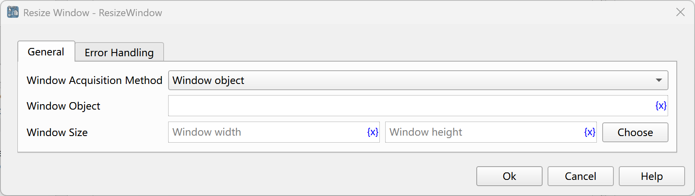

# Resize Window

Resize the specified window.

## Instruction Configuration

### Window Acquisition Method

Select the method for acquiring the window:

* Window Object: Resize the selected window object.
* Window Title or Class Name: Resize the window with the specified title or class name.
* Capture Window Element: Resize the window where the window element is located.

### Window Object

Select a window object from the process variables.

### Window Title

Enter the window title. You can also click the "Select" button to select the title of a window from all currently open desktop windows.

### Use Window Class Name

If this option is checked, the window class name will be used as a matching condition simultaneously.

### Window Class Name

Enter the window class name. You can also click the "Select" button to select the class name of a window from all currently open desktop windows.

### Use Regular Expression Matching

If this option is checked, the window title will be matched as a regular expression.

### Window Element

Select a window element from the element library, or click the "Capture Element" button to obtain it using the tool. For details, please refer to [Window Element Capture Tool](../../../manual/window_element_capture_tool.md).

### Window Size

Enter the window size, or click the "Select" button to select the size of a window from all currently open desktop windows.

### Error Handling

If the web page is not found, or an error occurs during the execution of the instruction, error handling will be performed. For details, see [Error Handling of Instructions](../../../manual/error_handling.md).