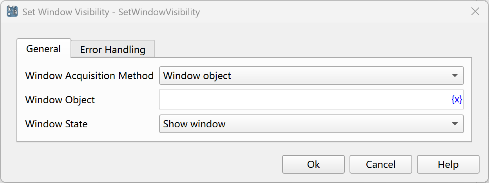

# Set Window Visibility

Set the visibility of the specified window, which is used to hide or show the window.

## Instruction Configuration

### Window Acquisition Method

Select the method of acquiring the window:

* Window Object: Set the visibility of the selected window object.
* Window Title or Class Name: Set the visibility of the window with the specified title or class name.
* Capture Window Element: Set the visibility of the window where the window element is located.

### Window Object

Select a window object from the process variables.

### Window Title

Enter the window title, or click the "Select" button to select the title of a window from all currently open desktop windows.

### Use Window Class Name

If this option is checked, the window class name will be used as a matching condition at the same time.

### Window Class Name

Enter the window class name, or click the "Select" button to select the class name of a window from all currently open desktop windows.

### Use Regular Expression Matching

If this option is checked, the window title will be matched as a regular expression.

### Window Element

Select a window element from the element library, or click the "Capture Element" button to use the tool to obtain it. For details, please refer to [Window Element Capture Tool](../../../manual/window_element_capture_tool.md).

### Window State

Select the window state to be set: Show Window, Hide Window.

### Error Handling

If the web page is not found or an error occurs during the execution of the instruction, error handling will be performed. For details, see [Error Handling of Instructions](../../../manual/error_handling.md).