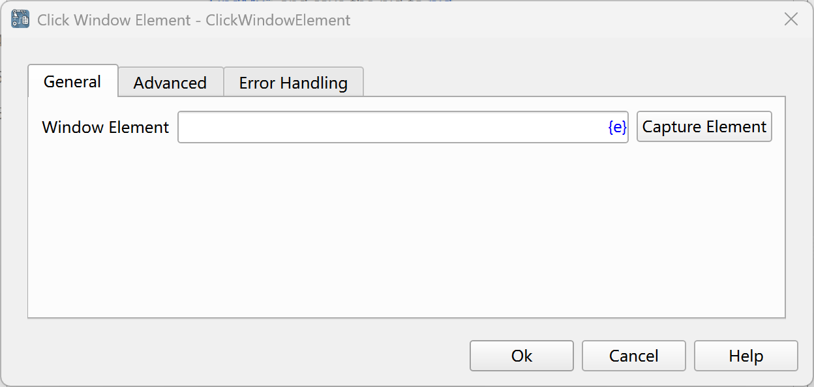
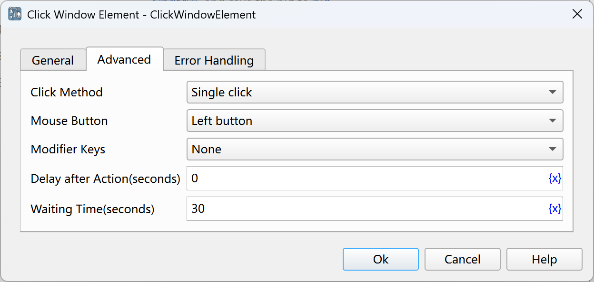

# Click Window Elements

Simulate the operation of mouse - clicking window elements, such as buttons, links, etc.

## Instruction Configuration

### Window Elements

Select a window element from the element library, or click the "Capture Element" button to call the tool for acquisition. For details, please refer to [Window Element Capture Tool](../../manual/window_element_capture_tool.md).

### Click Method

Single - click or double - click.

### Mouse Button

Left button, middle button, right button.

### Modifier Keys

Select the modifier keys to be pressed simultaneously. The available values are: None, Alt, Ctrl, Shift.

### Delay after Execution

After executing the instruction, delay for a period of time before continuing to execute the subsequent instructions. The unit is seconds.

### Waiting Time

The time to wait for the window element to appear. The unit is seconds.

### Error Handling

If an error occurs during the execution of the instruction, error handling will be performed. For details, see [Error Handling of Instructions](../../manual/error_handling.md).