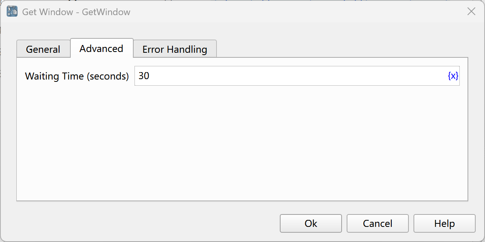

# Get Window

Obtain the specified window and save it into the process variable.

## Instruction Configuration

### Window Acquisition Method

Select the method of getting the window:

* Current Active Window: Get the current active window.
* Window Title or Class Name: Get the window with the specified title or class name.
* Capture Window Element: Get the window where the window element is located.

### Window Title

Enter the window title, or click the "Select" button to select the title of a window from all the currently open desktop windows.

### Use Window Class Name

If this option is checked, the window class name will be used as a matching condition simultaneously.

### Window Class Name

Enter the window class name, or click the "Select" button to select the class name of a window from all the currently open desktop windows.

### Use Regular Expression Matching

If this option is checked, the window title will be matched as a regular expression.

### Window Element

Select a window element from the element library, or click the "Capture Element" button to obtain it using the tool. For details, please refer to [Window Element Capture Tool](../../manual/window_element_capture_tool.md).

### Window Object

Enter the name of the process variable used to save the found window object.

### Waiting Time (seconds)

The time to wait for the specified window to appear, with a default of 30 seconds.

### Error Handling

If the web page is not found or an error occurs during the execution of the instruction, error handling will be performed. For details, see [Error Handling of Instructions](../../manual/error_handling.md).