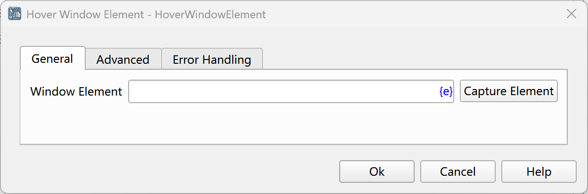
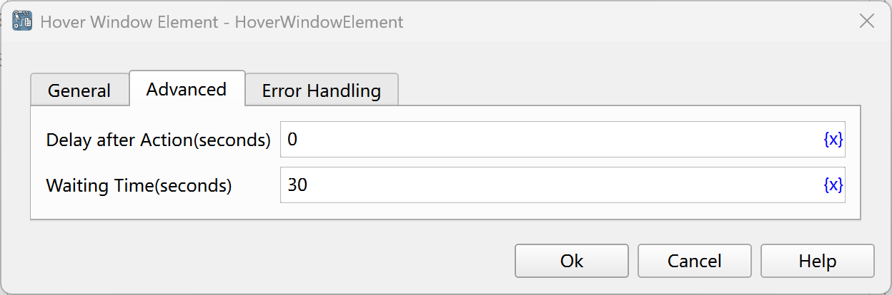

# Hover Window Element

Simulate the operation of hovering the mouse over a window element.

## Instruction Configuration

### Window Element

Select a window element from the element library, or click the "Capture Element" button to call the tool for acquisition. For details, please refer to [Window Element Capture Tool](../../manual/window_element_capture_tool.md).

### Delay After Action

After executing the instruction, delay for a certain period of time before continuing to execute the subsequent instructions. The unit is seconds.

### Waiting Time

The time to wait for the window element to appear, with the unit being seconds.

### Error Handling

If an error occurs during the execution of the instruction, perform error handling. For details, see [Error Handling of Instructions](../../manual/error_handling.md).