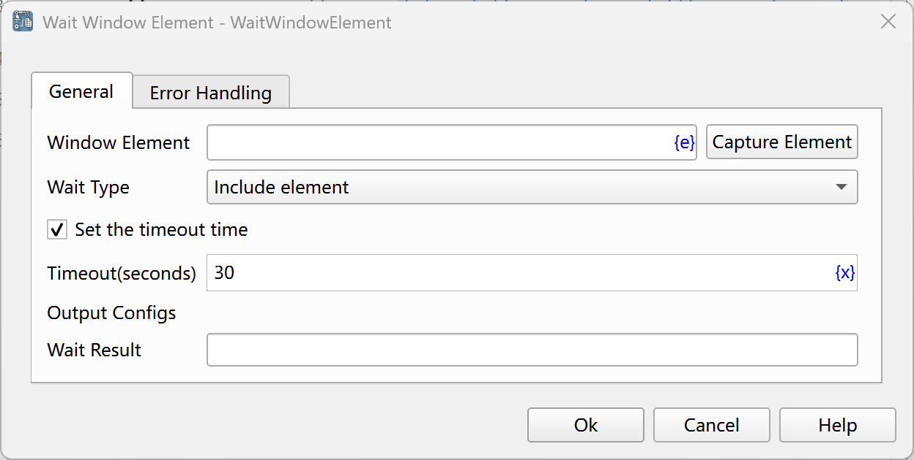

# Wait for Window Element

Wait for the window element to meet the specified conditions, and then execute subsequent instructions.

## Instruction Configuration

### Window Element
Select a window element from the element library, or click the "Capture Element" button to call the tool to obtain it. For details, please refer to [Window Element Capture Tool](../../manual/window_element_capture_tool.md).

### Wait Type
The wait type can be selected as: contains the element, does not contain the element.

### Set Supermarket Time
If this option is checked, wait for the element to meet the specified conditions until the timeout. Otherwise, return the waiting result immediately.

### Wait Time
The timeout for waiting for the window element to meet the specified conditions, with the unit being seconds.

### Wait Result
Enter the name of the process variable used to save the waiting result. This result is a boolean variable. If the conditions are met, the value is true. If the conditions are not met or the timeout occurs, the value is false.

### Error Handling
If the waiting times out or an error occurs during the execution of the instruction, execute the error handling. For details, see [Error Handling of Instructions](../../manual/error_handling.md). 