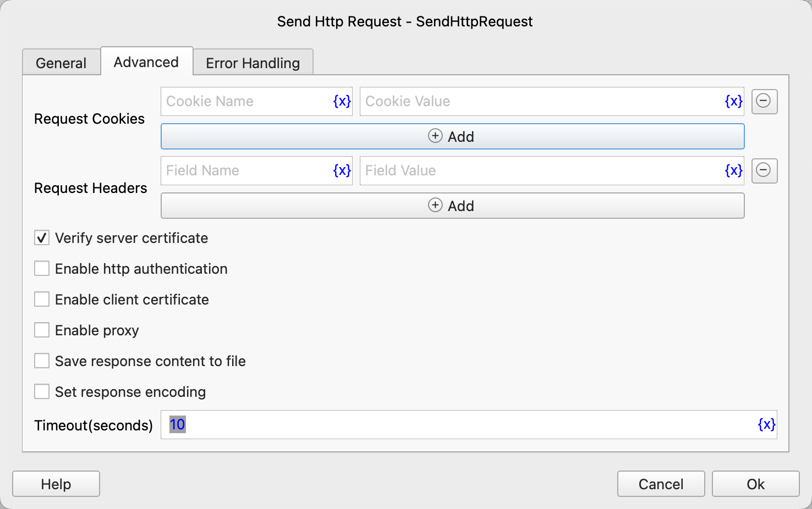

# Send Http Request

Send an HTTP request and save the response result to a process variable.

## Instruction Configuration

### Request URL

Enter the URL address for the request, supporting HTTP and HTTPS protocols, such as `https://www.example.com/some/path`.

### Request Method

Select the request method, supporting `GET`, `POST`, `PUT`, `DELETE`, `OPTIONS`, `HEAD`, `PATCH`.

### Request Params

Fill in the query parameters for the request.

### Request Body Type

Select the request body type, supporting the following options:

* `none`: Do not send a request body.
* `Form with Attachments`: Send a form request with attached files.
* `Form without Attachments`: Send a form request without attached files.
* `JSON Data`: Send a request body in JSON format.
* `XML Data`: Send a request body in XML format.
* `Text`: Send a request body in other text formats.
* `Binary Data`: Send a request body in binary format.

### Form with Attachments

If the request body type is `Form with Attachments`, you need to fill in the form with attachments, and you can add text parameters and file parameters.

### Form without Attachments

If the request body type is `Form without Attachments`, you need to fill in the form without attachments.

### Request JSON

If the request body type is `JSON Data`, you need to fill in the request body in JSON format.

### Request XML

If the request body type is `XML Data`, you need to fill in the request body in XML format.

### Request Text

If the request body type is `Text`, you need to fill in the request body in text format.

### Request File

If the request body type is `Binary Data`, you need to fill in the file path containing the request body.

### Request Cookies

Fill in the Cookie information for the request.

### Request Headers

Fill in the request header information.

### Verify server certificate

For HTTPS requests, you can choose whether to validate the server certificate. If validation is selected and the server certificate is invalid, the request will fail.

### Enable http authentication

If the request requires HTTP authentication, you need to select this option and fill in the authentication username and password.

### Authentication Method

Select the authentication method, supporting `Basic` and `Digest` authentication methods.

### Username

Fill in the authentication username.

### Password

Fill in the authentication password.

### Enable client certificate

If the request requires a client certificate, you need to select this option and fill in the certificate file path and key file path.

### Client Cert File

Select the client certificate file.

### Client Key File

Select the client key file.

### Enable Proxy

If the request requires a proxy, you need to select this option and fill in the proxy server information.

### Proxy Server

Fill in the protocol, username, password, address, and port of the proxy server.

### Save response content to file

Choose whether to save the response content to a file. If saving is selected, you need to fill in the file path to save.

If you choose to save the response content to a file, you cannot obtain the response content through the response result variable. The response result variable will only retain the response status code and header information.

### File Save Directory

Select the directory to save the file. If the directory does not exist, it will be automatically created.

### File Name

Select the name of the file to save. If the file already exists, an error will be reported.

### Timeout (Seconds)

Set the connection and read timeout for the request, in seconds, defaulting to 10 seconds. If the connection is not successful or response data is not read within this time, the request will fail.

Note that this does not limit the total time for downloading response data.

### Response Object

Enter the name of the process variable used to save the response result. The response object contains the following attributes:

* `status_code`: Response status code.
* `reason`: Response reason.
* `headers`: Response header information, which is a dictionary object.
* `cookies`: Response Cookie information, which is a dictionary object.
* `sessionCookies`: The `cookies` attribute can only obtain the Cookie information returned by the current response. If there is a redirection, the Cookie information returned by intermediate responses cannot be obtained. In this case, you can use the `sessionCookies` attribute to obtain all currently active Cookie information.
* `text`: Response text content.
* `json`: Response JSON data.
* `content`: Response binary data, which is a byte string.
* `encoding`: Response text encoding.

### Error Handling

If the instruction execution encounters an error, error handling will be executed. For details, see [Instruction Error Handling](../../manual/error_handling.md).
