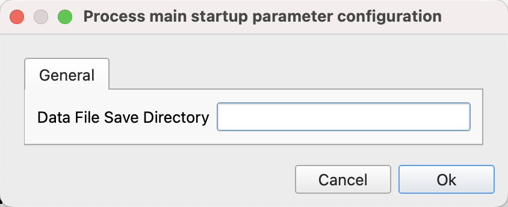
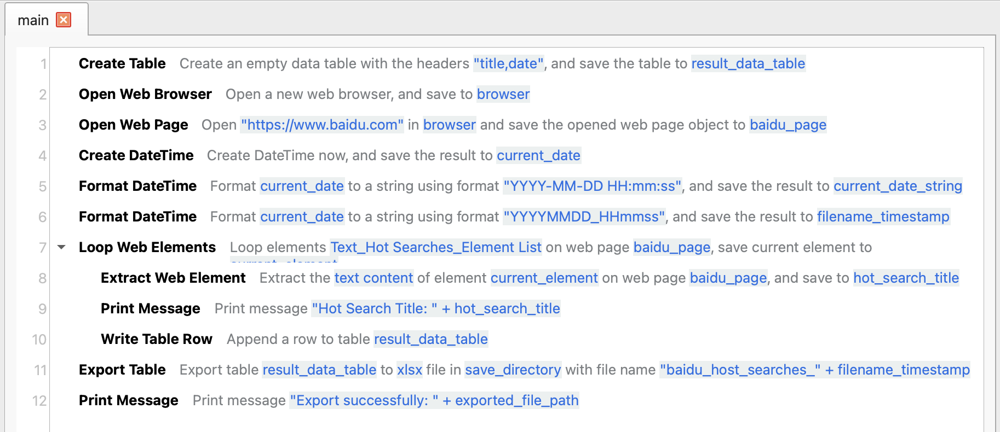
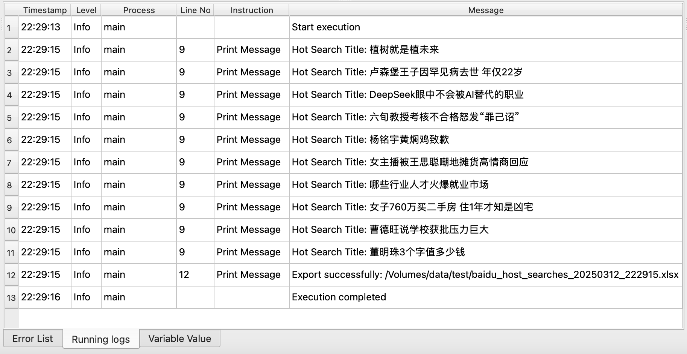
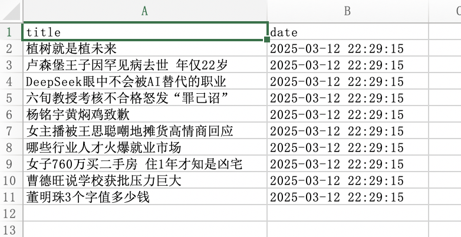

# Collect Baidu Hot Searches

This example application can collect the hot searches on the homepage of Baidu Search and save them to an Excel file.

## Download

Click [here](../../examples/collect_baidu_hot_searches.zip) to download the zip archive of the application.

## Usage

After downloading the application, unzip it to a local directory, and then open the application in JimuFlow.

After opening the application, run the main process, and the following startup parameters will be displayed:

* Data File Save directory: Enter the save directory of the Excel file.

After filling in the startup parameters and starting the application, the application will automatically complete the collection work and save the collected data to the Excel file.

## Application Process Explanation

The general process of this application is as follows:

1. Create a data table to save the collected data.
2. Open a web browser and jump to the homepage of Baidu Search.
3. Traverse all the hot search elements on the web page and save the hot search titles to the data table.
4. Export the data table as an Excel file and save it to the specified directory.

## Related Screenshots

The main process:

Running logs:

Collected data:

 
