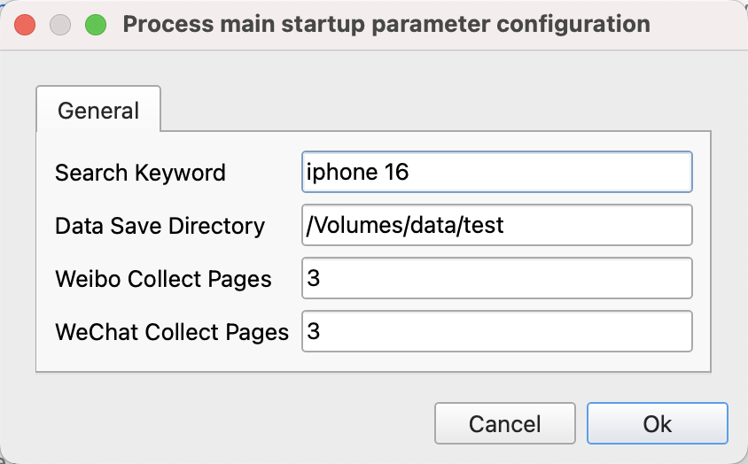
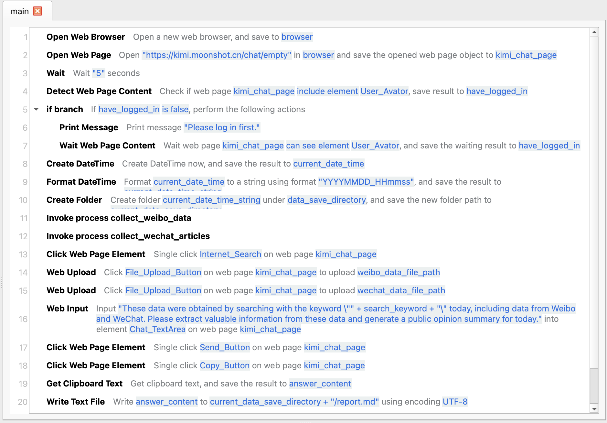
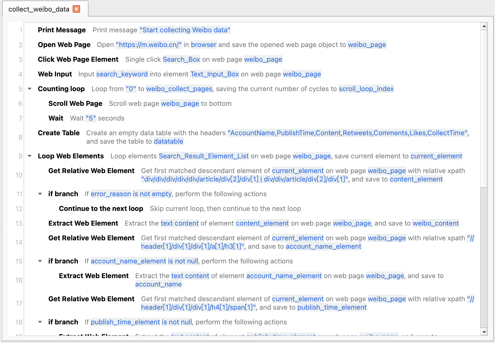
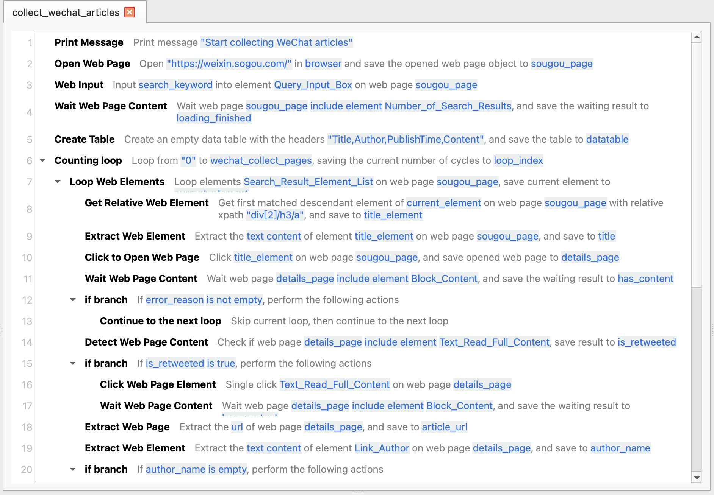
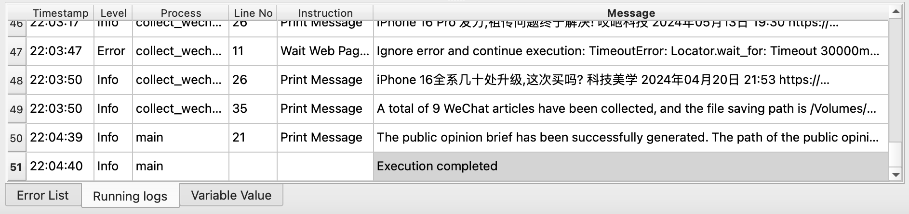
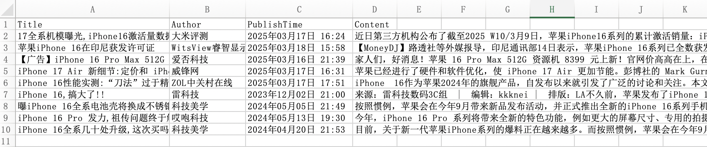
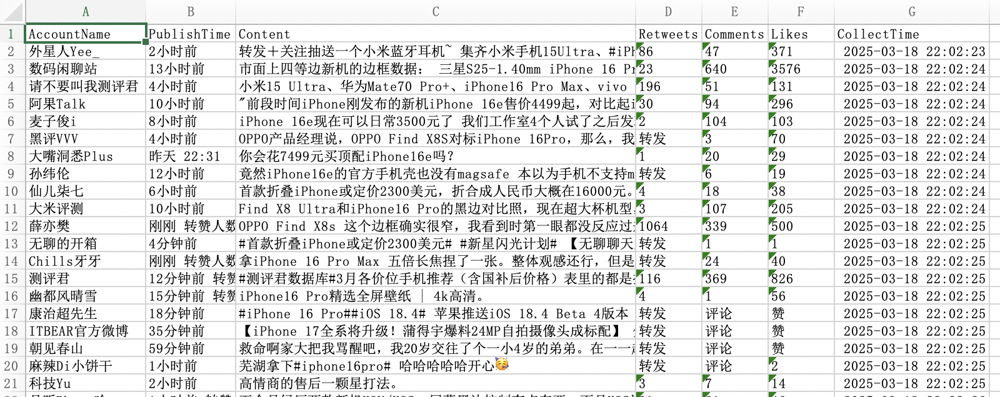
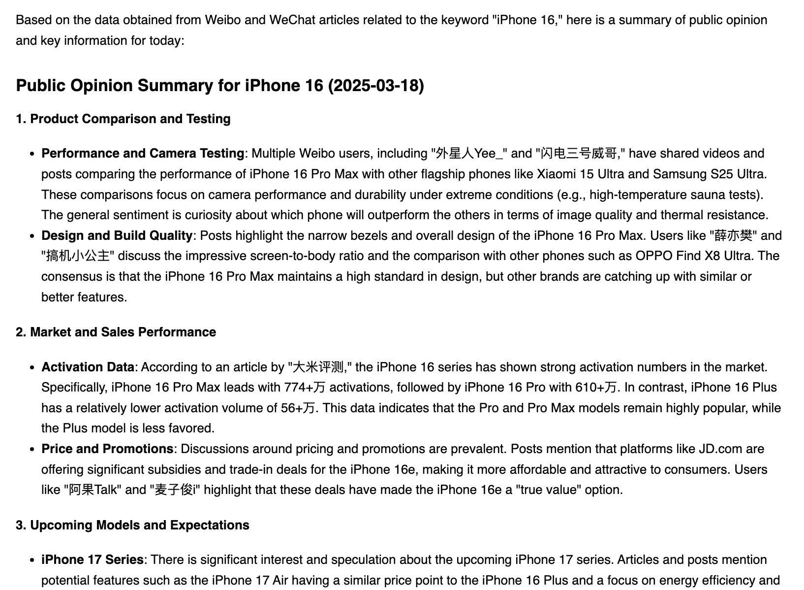

# Creating a Daily Public Opinion Briefing

This sample application can collect data from Weibo and articles from WeChat official accounts based on keywords provided by the user, and then generate a public opinion briefing by invoking the Kimi AI Assistant web version.

## Download

Click [here](../../examples/make_public_opinion_daily.zip) to download the application's zip package.

## Usage

After downloading the application, extract it to a local directory, then open the application in JimuFlow.

Once the application is opened, run the main process `main`, and the following startup parameters will be displayed:

* Search Keyword: Enter the keyword to search for.
* Data Save Directory: Enter the directory to save the data.
* Weibo Collect Pages: Enter the number of pages to collect from Weibo, default is 3 pages.
* WeChat Collect Pages: Enter the number of pages to collect from WeChat articles, default is 3 pages.

After the application starts, it will open a browser and navigate to the Kimi AI Assistant webpage. The user needs to manually complete the login. Once logged in successfully, the user can leave it alone, and the application will automatically complete the remaining tasks.

After the process ends, the user can find the collected data and the generated public opinion briefing in the data save directory.

Note: If the amount of data collected is large, Sogou WeChat may pop up a CAPTCHA, and the user will need to manually enter the CAPTCHA.

## Application Process Description

The general process of this application is as follows:

1. Search and collect data from Weibo via https://m.weibo.cn/, then save it to an Excel file.
2. Search and collect data from WeChat articles via https://weixin.sogou.com/, then save it to an Excel file.
3. Upload the Excel file to the Kimi AI Assistant web version, then invoke the Kimi AI Assistant web version to generate a public opinion briefing.

## Related Screenshots

Main Process:

Weibo Data Collection Sub-process:

WeChat Official Account Article Collection Sub-process:

Running Logs:

WeChat Collected Data:

Weibo Collected Data:

Generated Final Public Opinion Briefing:

Click [here](report.md) to view a sample of the complete generated report.
