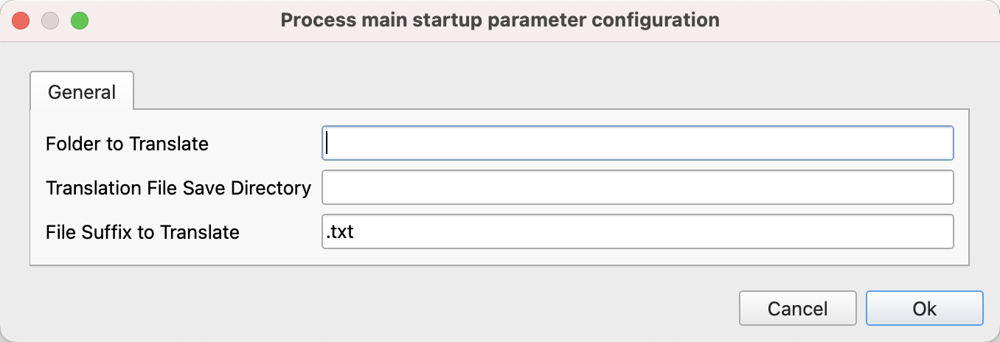
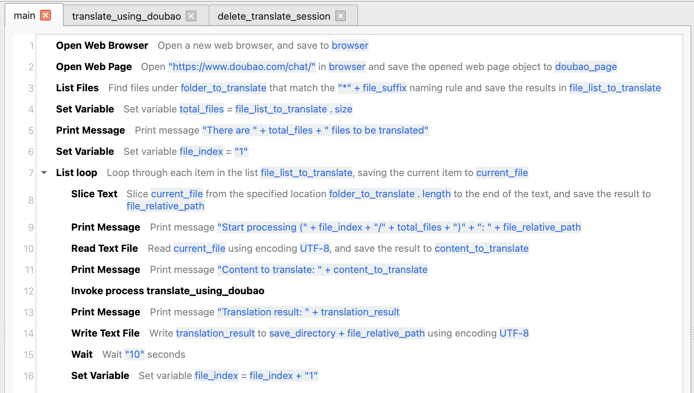
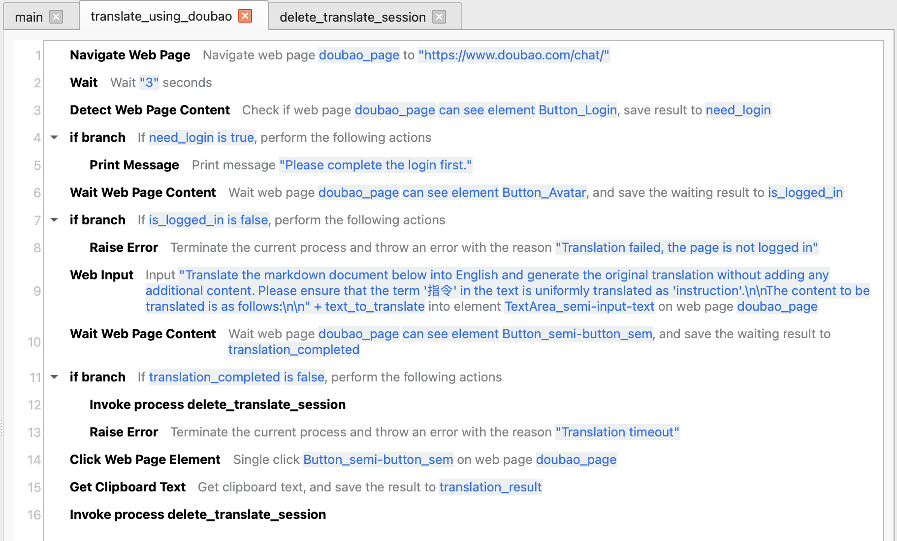
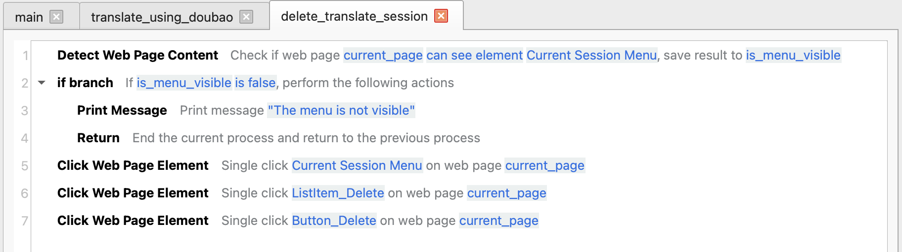
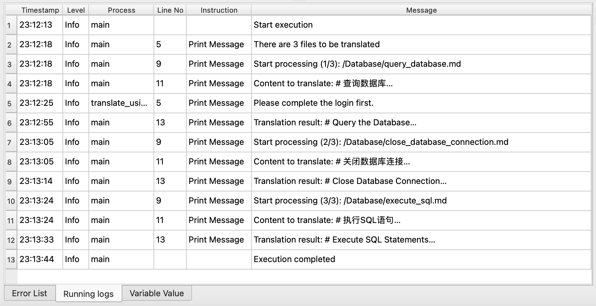

# Batch Translation of Text Files Using a Large Language Model

This example application implements the function of batch translating text files using [Doubao Web Version](https://www.doubao.com/chat/).

## Download

Click [here](../../examples/translate_text_files.zip) to download the zip archive of the application.

## Usage

After downloading the application, unzip it to a local directory, and then open the application in JimuFlow.

After opening the application, run the main process "main", and the following startup parameters will be displayed:

* Folder to Translate: Enter the path of the folder where the files to be translated are located.
* Translation File Save Directory: Enter the path of the directory where the translated files will be saved.
* File Suffix to Translate: Enter the file extension of the files to be translated, with the default being ".txt".

After the application is launched, a browser will be opened and redirected to the Doubao website. The user needs to complete the login manually. After a successful login, the user can ignore it, and the application will automatically complete the remaining work.

During the translation process, the browser can be switched to the background, and then the user can perform other tasks on the computer.

## Application Process Explanation

The general process of this application is as follows:

1. Open a web browser and redirect to the Doubao chat page.
2. Search for all files with the specified file extension under the folder to be translated and all its subfolders, and save them to the list of files to be translated.
3. Traverse the files in the list of files to be translated and perform the following processing:
    1. Open a new conversation on the Doubao chat page.
    2. Check whether the user is logged in. If not, prompt the user to log in and wait for the user to log in.
    3. Send the translation instruction and the content of the file to be translated to Doubao, and wait for Doubao to return the translation result.
    4. Extract the translation result from the web page.
    5. Delete the current conversation to avoid interfering with other conversations.
    6. Obtain the path of the translated file relative to the folder to be translated, and then save the translation result to the same path in the save directory for translated files.

If an error occurs during the translation process, the process will automatically retry. The number of retries is 100 times, and the retry interval is 60 seconds. If there is still an error after the retries, the process will stop running.

## Related Screenshots

Main process:

Translation sub-process:

Delete conversation sub-process:

Running logs (batch translation of markdown documents):

 
