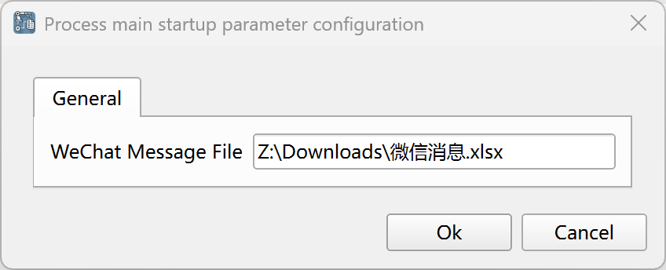
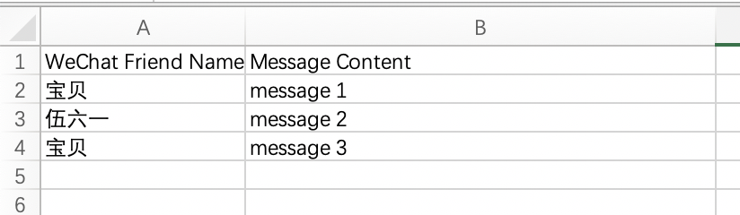
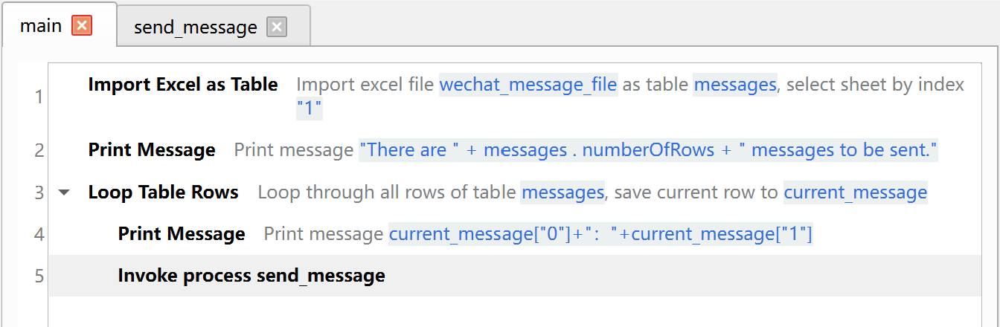
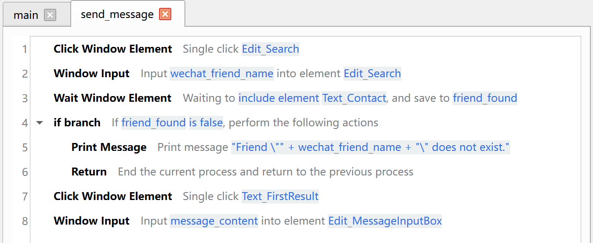
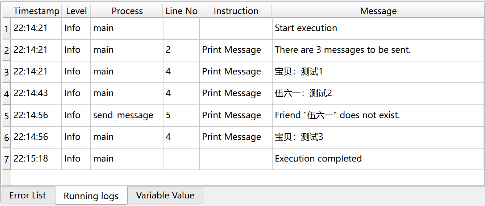

# Batch Sending of Messages on WeChat

This example application implements the function of batch sending messages on WeChat.

## Download

Click [here](../../examples/wechat_send_message.zip) to download the zip compressed package of the application.

## Usage

After downloading the application, unzip it to the local directory, and then open the application in JimuFlow.

After opening the application, run the main process "main", and the following startup parameters will be displayed:

* WeChat Message Excel File: Enter the path of the message configuration file.

Before starting the application, please start WeChat first and complete the login.

The message configuration file needs to contain two columns. The first column is the name of the WeChat friend, and the second column is the content of the message, as shown below:

## Description of the Application Process

The general process of this application is as follows:

1. Read the Excel file to obtain the message configuration information.
2. Loop through the message configuration information and send messages one by one.

## Related Screenshots

The main process:

The sub-process of sending WeChat messages:

Running logs:

 