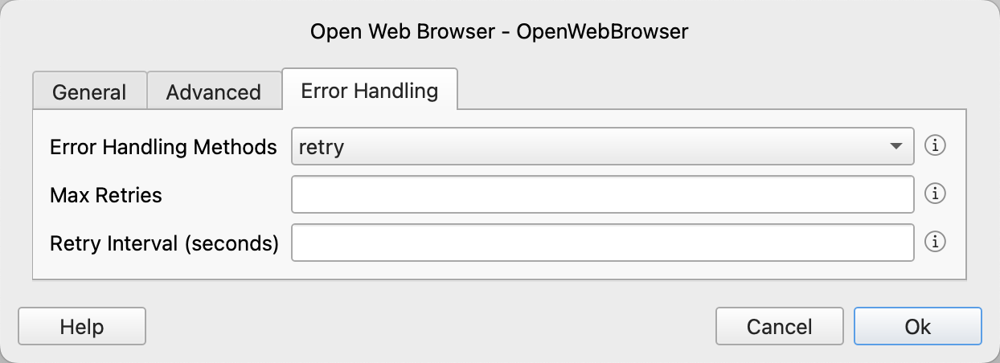

# Error Handling for Instructions

For instructions that may encounter errors, we provide a general error handling mechanism.

In the configuration dialog of the instruction, error handling related configurations are available as shown below:

### Error Handling Methods

We offer three error handling methods: end the process, retry, or ignore the error and continue execution.

If you choose to end the process, the application will terminate when the instruction encounters an error.

If you choose to retry, the system will retry according to the configured number of retries and retry interval. If the retry is still unsuccessful, the application will terminate.

If you choose to ignore the error and continue execution, you need to configure the output variable value in case of an error. The system will set the output variable of the instruction to this value and then continue to execute subsequent instructions.
If the instruction does not have an output variable, no configuration is needed.

### Max Retries

The number of retries.

### Retry Interval (seconds)

The interval time for retries, in seconds.

### Outputs On Error

Enter the value of the output variable for this instruction.
