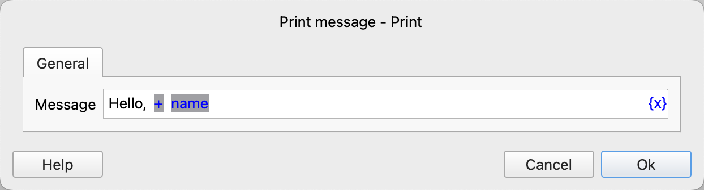
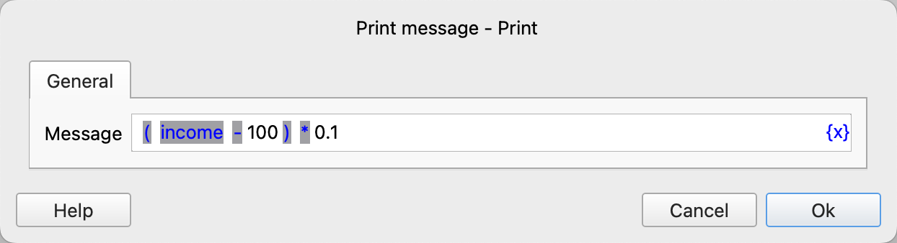
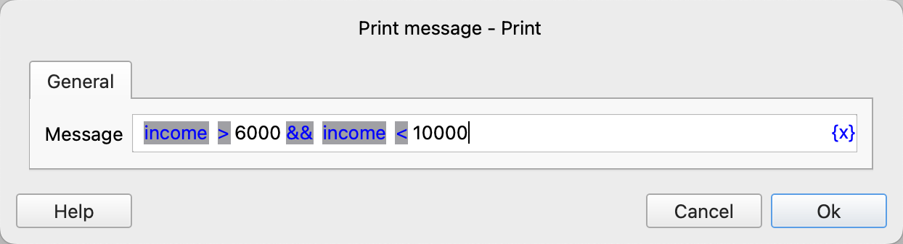
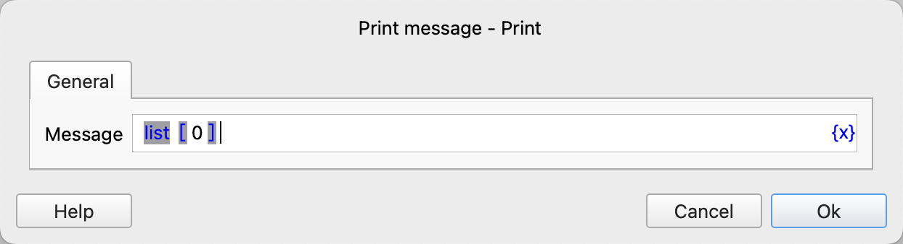
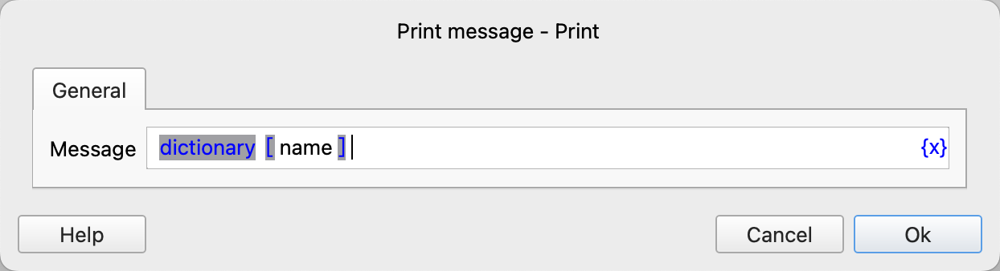
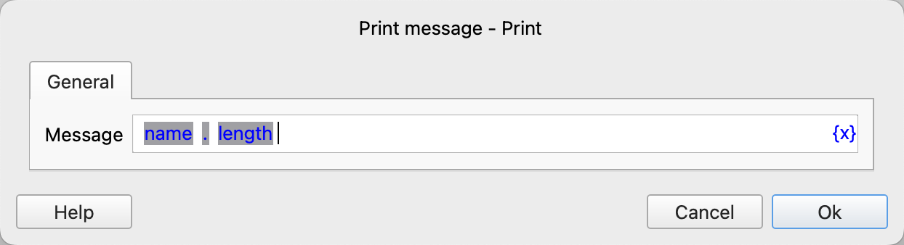

# Expressions

In the configuration of instructions, we often need to use expressions, which have a syntax similar to mathematical expressions but are more powerful.

We can use expressions to perform mathematical operations, string manipulations, comparison judgments, and access variables and their properties.

Expressions consist of literals, variables, and operators.

Below are some common examples of expressions:

The above expression concatenates the string "Hello, " with the variable "name". If the name is "Xiao Ming", the result of the expression will be "Hello, Xiao Ming".

The above expression subtracts 100 from the income and then multiplies the result by 0.1. If the income is 10000, the result of the expression will be 990.

The above expression checks whether the income is greater than 6000 and less than 10000.

The above expression is used to retrieve the first value in a list.

The above expression is used to retrieve the value associated with the key "name" in a dictionary.

The above expression is used to retrieve the length of a name.

## Literals

Values entered directly into expressions are called literals. There are currently three types of literals: strings, numbers, and boolean values.

String literals consist of any characters, such as "abc123".

Number literals support decimals and integers, such as 3.14, 100, -3.14, -100.

Boolean literals are true and false, where true represents truth or a condition being met, and false represents falsity or a condition not being met.

## Variables

In expressions, you can access the values stored in variables by their names. Variable names must start with a letter, Chinese character, or underscore, followed by letters, Chinese characters, numbers, or underscores.

In addition to directly accessing the values of variables, you can also access the properties of variables using the property access operator. The properties a variable has are determined by its type.

### Text Type - text

Text is a string composed of any characters. Text variables have the following properties:

- length: Gets the length of the text.
- lower: Gets the text converted to lowercase.
- upper: Gets the text converted to uppercase.

### Number Type - number

The number type can represent integers or decimals. Number variables have the following properties:

- round: Gets the integer after rounding.
- floor: Gets the integer after rounding down.
- ceil: Gets the integer after rounding up.
- abs: Gets the absolute value.

### Boolean Type - bool

The boolean type has only true and false. Boolean variables have no properties.

### List Type - list

A list is an ordered collection of elements. List variables have the following properties:

- size: Gets the number of elements in the list.

### Dictionary Type - dict

A dictionary is an unordered collection of key-value pairs. Dictionary variables have the following properties:

- size: Gets the number of key-value pairs in the dictionary.
- keys: Gets a list of all keys in the dictionary.
- values: Gets a list of all values in the dictionary.
- items: Gets a list of all key-value pairs in the dictionary.

### Data Table Type - table

A data table represents tabular data. Data table variables have the following properties:

- numberOfRows: Gets the number of data rows in the table, excluding the header.
- numberOfColumns: Gets the number of data columns in the table.
- columnNames: Gets a list of all column names in the header.
- rows: Gets a list of all data rows in the table.

### Date Type - date

The date type represents a year-month-day date. Date variables have the following properties:

- year: Gets the year.
- month: Gets the month.
- day: Gets the day.

### Time Type - time

The time type represents an hour-minute-second time. Time variables have the following properties:

- hour: Gets the hour.
- minute: Gets the minute.
- second: Gets the second.
- microsecond: Gets the microsecond.

### Datetime Type - datetime

The datetime type represents a year-month-day hour-minute-second time. Datetime variables have the following properties:

- date: Gets the date part, of type date.
- time: Gets the time part, of type time.
- year: Gets the year.
- month: Gets the month.
- day: Gets the day.
- hour: Gets the hour.
- minute: Gets the minute.
- second: Gets the second.
- microsecond: Gets the microsecond.
- timestamp: Gets the timestamp in seconds.

### File Path Information Type - FilePathInfo

The file path information type contains information related to file paths. File path information variables have the following properties:

* root: Root directory
* parent: Parent directory
* name: File name
* nameWithoutExtension: File name without extension
* extension: File extension
* exists: Whether the file exists
* isDirectory: Whether it is a directory
* isFile: Whether it is a file
* size: File size in bytes
* ctime: Creation time, a timestamp in seconds
* mtime: Modification time, a timestamp in seconds

### Byte String Type - bytes

The byte string type is used to represent binary byte data, and has the following attributes:

* length: Get the number of bytes of the byte string.

### Web Browser Type - WebBrowser

The web browser type represents an open web browser object.

### Web Page Type - WebPage

The web page type represents an open web page object. Web page variables have the following properties:

- url: Gets the URL of the web page.

### Web Element Type - WebElement

The web element type represents a web element object, such as a button or link.

### Window Element Type - WindowElement

The window element type represents a window object or an element within a window.

### HTTP Response Type - HttpResponse

The HttpResponse type represents an HTTP response object, and has the following properties:

* `status_code`: Response status code.
* `reason`: Response reason.
* `headers`: Response header information, which is a dictionary object.
* `cookies`: Response Cookie information, which is a dictionary object.
* `sessionCookies`: The `cookies` attribute can only obtain the Cookie information returned by the current response. If there is a redirection, the Cookie information returned by intermediate responses cannot be obtained. In this case, you can use the `sessionCookies` attribute to obtain all currently active Cookie information.
* `text`: Response text content.
* `json`: Response JSON data.
* `content`: Response binary data, which is a byte string.
* `encoding`: Response text encoding.

## Operators

| Operator Name | Operator | Precedence | Description                                           |
|---------------|----------|------------|-------------------------------------------------------|
| Logical OR    | \|\|     | 1          | Logical operation, returns true if either operand is true, otherwise false.      |  
| Logical AND   | &&       | 2          | Logical operation, returns true if both operands are true, otherwise false.        |  
| Equal         | ==       | 3          | Comparison operation, returns true if both operands are equal, otherwise false.            |   
| Not Equal     | !=       | 3          | Comparison operation, returns true if both operands are not equal, otherwise false.           |   
| Greater Than  | \>       | 4          | Comparison operation, returns true if the left operand is greater than the right, otherwise false.         |  
| Greater Than or Equal | \>=  | 4          | Comparison operation, returns true if the left operand is greater than or equal to the right, otherwise false.       |  
| Less Than     | \<       | 4          | Comparison operation, returns true if the left operand is less than the right, otherwise false.         | 
| Less Than or Equal | \<=  | 4          | Comparison operation, returns true if the left operand is less than or equal to the right, otherwise false.       |
| Addition      | +        | 5          | Mathematical addition operation                                       |
| Subtraction   | -        | 5          | Mathematical subtraction operation                                       |
| Multiplication| *        | 6          | Mathematical multiplication operation                                       |
| Division      | /        | 6          | Mathematical division operation                                       |
| Modulus       | %        | 6          | Mathematical modulus operation                                       |
| Exponentiation| **       | 6          | Mathematical exponentiation operation, returns x raised to the power of y, e.g., 10**2 returns 100           |
| Floor Division| //       | 6          | Mathematical floor division operation - returns the integer part of the quotient (rounded down), e.g., 9//2 returns 4, -9//2 returns -5. |
| Logical NOT   | !        | 7          | Logical operation, inverts the boolean value, true becomes false, false becomes true.        |   
| Negation      | -        | 7          | Mathematical negation operation, positive becomes negative, negative becomes positive.                        |
| Index Access  | []       | 8          | Accesses list elements or dictionary key-value pairs.                                 |   
| Property Access| .       | 8          | Accesses object properties.                                      |   
| Parentheses   | ()       | 9          | Evaluates the expression inside the parentheses first.                                 |

Operators with higher precedence are executed before those with lower precedence. If two operators have the same precedence, they are executed from left to right.

If there are nested parentheses, the expression inside the innermost parentheses is evaluated first.

When unsure about operator precedence, you can use parentheses to explicitly specify the precedence.
