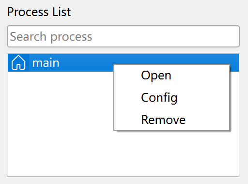
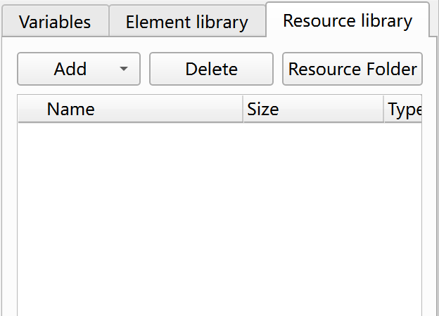

# Interface Features Introduction

## Main Interface

Upon launching JimuFlow, you will enter the main interface.

## Menu Bar

The menu bar includes menus such as File, Edit, Run, and Help.

File Menu:

- New App: Create a new RPA application.
- Open App: Open an existing RPA application.
- Config App: Modify the configuration information of the current RPA application.
- Recent Apps: View and open recently used RPA applications.
- New Process: Create a new process within the current application.
- Config Process: Modify the configuration information of the current process.
- Save Process: Save the current process.
- Delete Process: Delete the current process.

Edit Menu:

- Undo: Undo the last operation.
- Redo: Redo the last operation.

Run Menu:

- Run Process: Run the current process.
- Debug Process: Debug the current process.
- Resume Execution: During debugging, continue execution until the next breakpoint.
- Step Over: During debugging, execute the current statement and then pause.
- Step Into: During debugging, enter the sub-process and pause at the first statement.
- Step Out: During debugging, exit the current sub-process and pause at the next statement in the parent process.
- Stop Process: Stop the current process from running or debugging.

Help Menu:

- About JimuFlow: Display information about JimuFlow.
- Settings: Configure JimuFlow settings.
- Help: Display help information.

## Toolbar

The toolbar contains some commonly used operations, as shown below:

## New Application

When creating a new application, the New Application dialog will open, as shown below:

The New Application dialog contains the following fields:

- Namespace: The namespace is used to distinguish processes with the same name written by different people, using a format similar to reverse domain names, such as foo, foo.bar. Each part of the namespace consists of non-whitespace characters and underscores, excluding punctuation, with a total length not exceeding 100 characters.
- Application Name: Consists of non-whitespace characters and underscores, excluding punctuation, with a total length not exceeding 100 characters.
- Application Version: Represented by numbers separated by periods, such as 1, 1.0, 1.0.0, with a total length not exceeding 50 characters.
- Save Directory: The parent directory where the application directory will be saved.

## Configure Application

When configuring an application, the Configure Application dialog will open, as shown below:

In this dialog, you can modify the application's namespace, name, and version.

## New Process

When creating a new process, the New Process dialog will open, as shown below:

The New Process dialog contains the following fields:

- Process Name: Can use any non-whitespace characters and underscores, excluding punctuation, with a length not exceeding 100 characters.

## Configure Process

When configuring a process, the Configure Process dialog will open, as shown below:

In this dialog, you can modify the process name.

## Process List

The process list contains all processes of the current application, as shown below:

The top of the process list includes a search box, which can be used to quickly locate processes when there are many.

Each application has a main process, indicated by a house icon before the name, with the default name `main`. When executing the application, it starts from the main process.

Double-clicking a process name opens the process editing interface. Right-clicking a process name opens the process operation menu, including options such as open, configure, delete, and set as main process.

## Instruction List

The instruction list displays all instructions provided by JimuFlow, as shown below:

Currently, it includes 9 categories of instructions: Process Control, Wait, Web Automation, Windows Automation, Data Processing, Operating System, Mouse and Keyboard, Data Table, and Others.

Additionally, the process category in the instruction list displays all processes of the current application. Processes are also a type of instruction and can be used like other instructions.

Double-clicking an instruction adds it to the last line of the current process. If the instruction requires configuration, the instruction configuration dialog will open. Instructions can also be dragged to a specific position in the process.
Selecting a process and pressing F1 will display the instruction's help information.

The top of the instruction list includes a search box, which can be used to quickly locate instructions.

## Process Editor

The process editor is used to edit the instructions included in a process, as shown below:

The instructions included in the process are displayed in a tree structure, with each instruction node supporting the following operations:

- Add Instruction: Double-click an instruction in the instruction list or drag the instruction into the process editor.
- Modify Instruction Configuration: Double-click an instruction to open the instruction configuration dialog.
- Delete Instruction: Select an instruction and press Backspace or Delete, or right-click the instruction and select delete.
- Copy Instruction: Select an instruction and press Ctrl+C, or right-click the instruction and select copy.
- Paste Instruction: Press Ctrl+V to paste at the end of the process, or right-click an instruction and select paste before, inside, or after the current instruction.
- Cut Instruction: Select an instruction and press Ctrl+X, or right-click the instruction and select cut.
- Add Breakpoint: Right-click an instruction and select add breakpoint.
- Move Instruction: Drag the instruction to move it.

## Error List

The error list displays all error messages in the opened processes, as shown below:

Error messages include fields such as process name, line number, and error. Double-clicking an error message will jump to the corresponding process and line number.

## Running Logs

The running log displays log information of the currently running process, as shown below:

The running log includes fields such as time, level, process, line number, instruction, and message. Double-clicking a log message will jump to the corresponding process and line number.

## Variable Values

Variable values are used to view the call stack and associated real-time variable information of the currently debugging process, as shown below:

## Variable Panel

The variable panel is used to manage the variables of the current process, as shown below:

### Add Variable

Clicking the Add Variable button opens the Add Variable dialog, as shown below:

Variables have the following properties:

- Variable Name: Can use any non-whitespace characters and underscores, excluding punctuation, with a length not exceeding 50 characters.
- Variable Type: Can be text, number, boolean, list, dictionary, data table, date, time, etc.
- Variable Direction: Options include input variable, output variable, and local variable. Input variables are used to accept parameters passed by the user or parent process, output variables are used to pass processing results to the user or parent process, and local variables are used to temporarily store data within the process.
- Default Value: Configure a default value for input variables. Currently, only text, number, and boolean type variables support default values.
- UI Label: Configure the field label displayed in the process configuration dialog for input or output variables.
- UI Group: The configuration group to which the input variable belongs in the process configuration dialog. Input variables are divided into general and advanced groups.
- Required: Whether the input variable is mandatory.
- UI Sort No: The sort number of the input variable in the process configuration dialog.
- UI Input Type: The input control type for the input variable. Different variable types correspond to different input control types, such as text input box, multi-line text input box, dropdown, expression input box, variable input box, custom input box, etc., for text type; expression input box, checkbox, custom input box, etc., for boolean type.
- UI Placeholder: Hint information for the input or output variable's input control.
- UI Help Info: Help information for the input or output variable's input control.
- UI Depends On: Whether the input variable depends on other variables. If it depends on other variables, it will only be displayed when the dependent variables meet the conditions.
- UI Options: Configure the option list for dropdown input controls.
- UI Custom Input Control: Configure the component name for custom input controls.

### Delete Variable

Clicking the Delete Variable button will delete the selected variable.

## Element Library

The element library is used to manage the web elements and window elements of the current application, as shown below:

Clicking the Capture Element button opens the Capture Element tool. For details, please refer to [Web Element Capture Tool](web_element_capture_tool.md) and [Window Element Capture Tool](window_element_capture_tool.md).

## Resource Library

The resource library is used to manage file resources such as images used in process instructions, as shown below:

