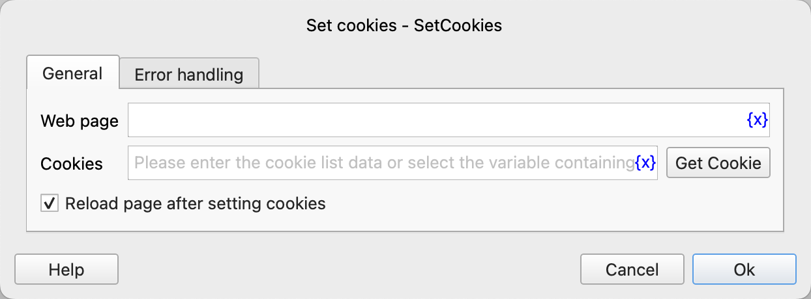
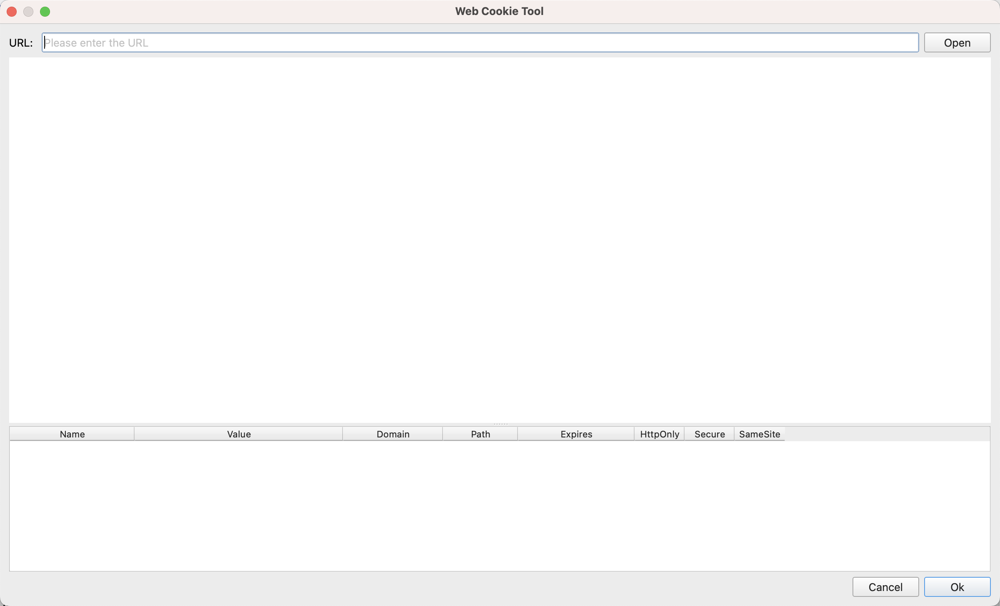
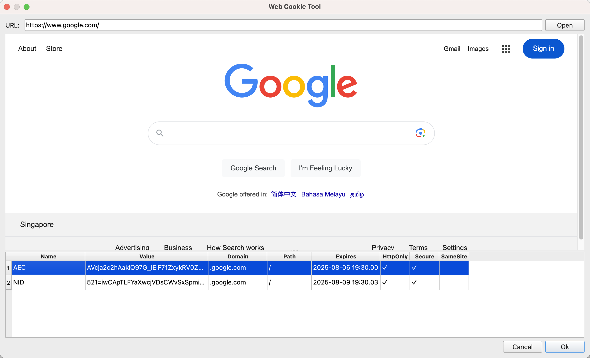

# Web Cookie Tool

This tool can be used to obtain web cookies in the instruction for setting cookies.

## Usage

Click the "Get Cookie" button in the instruction configuration dialog to open this tool.

After opening, enter the URL in the address box at the top, and then click the "Open" button. The tool will open the webpage as shown below:

Users can perform actions such as logging in on the webpage, and then select the desired cookies from the cookie list. Use Ctrl + left-click for non-continuous multiple selections, and Shift + left-click for continuous multiple selections. After making the selections, click the "Confirm" button at the bottom right to return to the instruction dialog. The selected cookies will be automatically filled into the instruction.