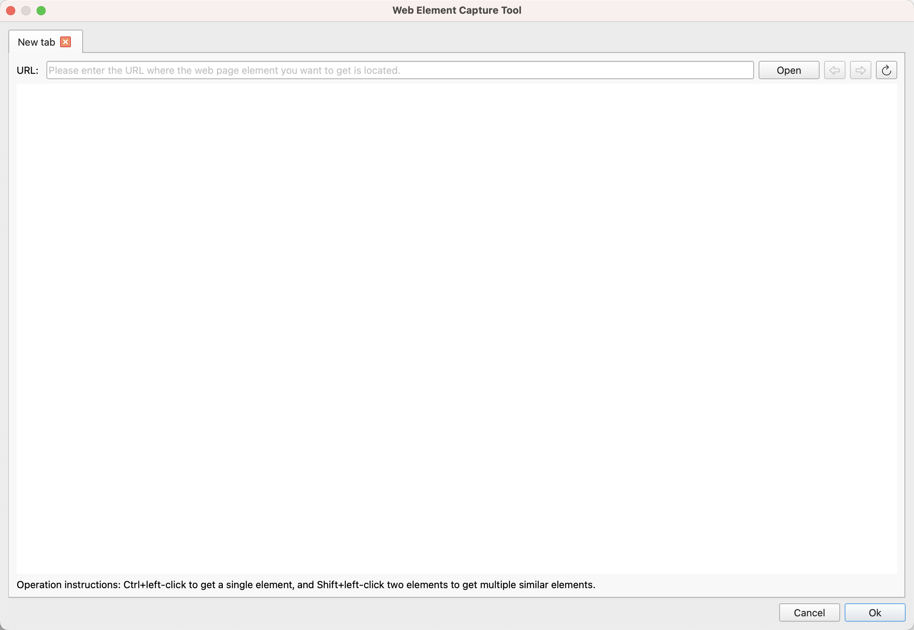
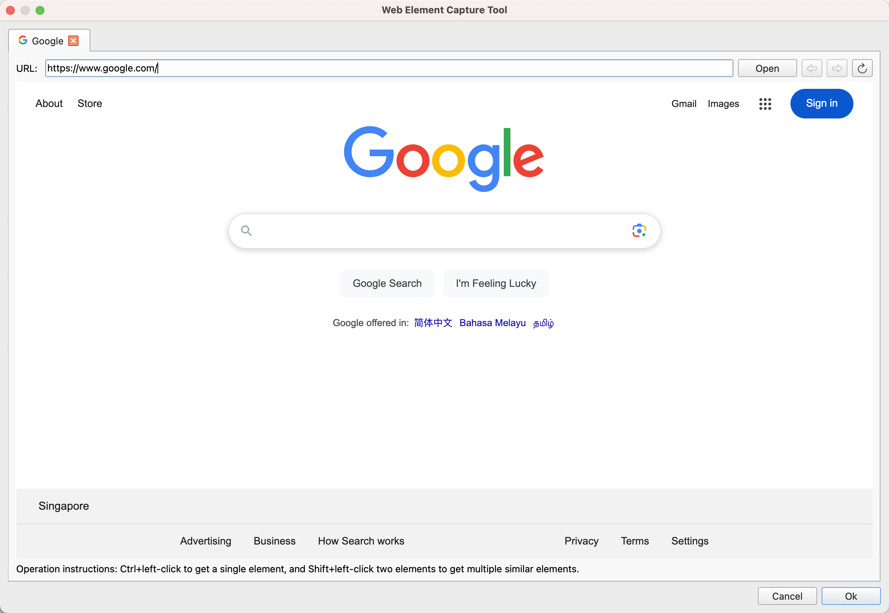
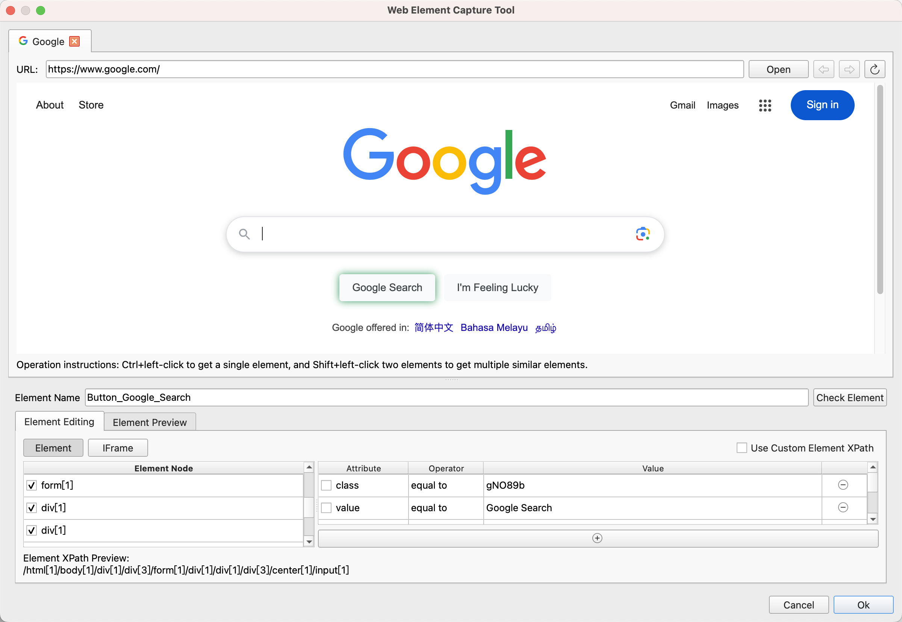
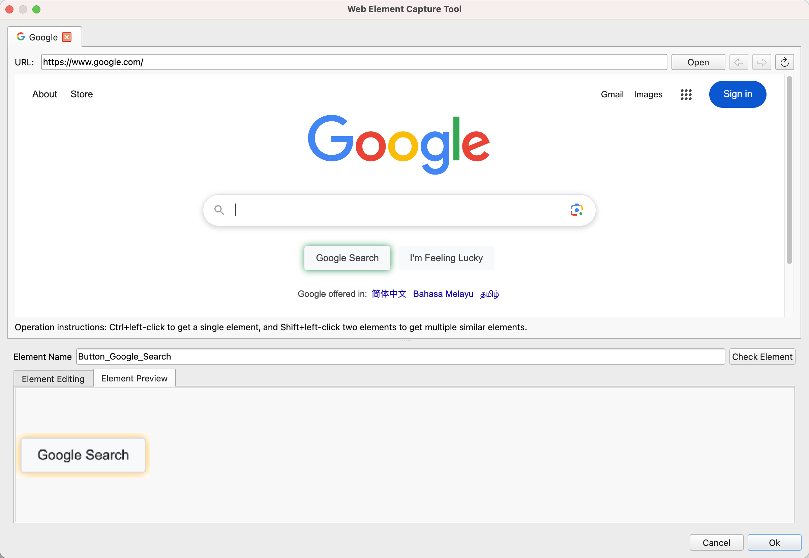

## Web Element Capture Tool

This tool is used to capture and edit web elements, which are then saved to the element library.

The capture interface is as follows:

After opening, enter the URL of the web element in the address box at the top, and then click the "Open" button. The tool will open the web page as shown below:

Use Ctrl + Left Click to capture a single element, and Shift + Left Click to capture multiple similar elements by clicking on two elements consecutively.

After capturing, the following editing interface will be displayed:

The captured web elements are located using IFrame XPath and element XPath paths. 
The IFrame XPath path is used to locate the IFrame object where the element is located. If the element is not within an IFrame, the IFrame XPath path will be empty.
The element XPath path is used to locate the element object within the window object.

The editing interface will display the IFrame XPath path and element XPath path of the captured element, which can be adjusted and edited as needed.

Users can also re-capture elements using Ctrl + Left Click or Shift + Left Click, or click the "Validate Element" button to find and highlight matching elements on the current web page to verify if the element is correct.

Clicking on the element node can search for and highlight the corresponding element in the current webpage.

The element preview interface allows users to view a screenshot of the element, as shown below:

After editing, click the "Confirm" button to save the element to the element library. If needed, the element can be further edited in the element library later.
