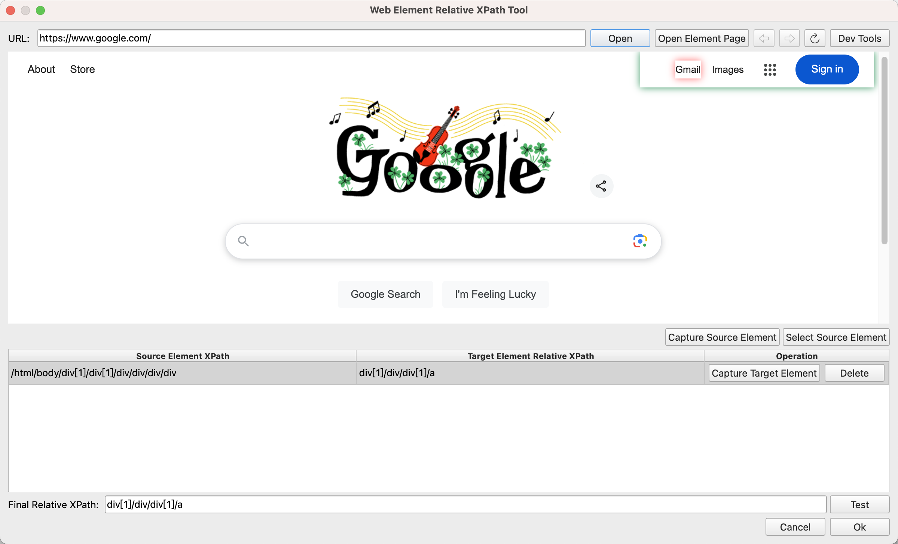
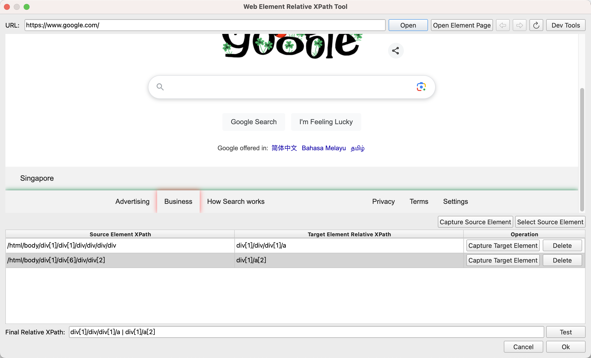

# Web Element Relative XPath Tool

In the [Get Relative Web Element](../commands/WebAutomation/WebElementOperation/get_relative_web_element.md) instruction, if you need to locate descendant elements, you need to configure the relative XPath path of the descendant elements relative to the parent element. You can quickly obtain the relative XPath path through this tool.

## Usage

Click the "Get Relative XPath" button in the configuration dialog box of the instruction to open this tool, as shown below:

Enter the URL of the target web page and click the `Open` button to open the target web page. You can also click the `Open Element Page` button, select a web element from the element library, and open the web page address when the element was captured.

After opening the target web page, click the `Capture Source Element` button, and then click the source element with Ctrl + left mouse button. The captured source element will be added to the table below, as shown below:

After capturing the source element, click the `Capture Target Element` button in the row corresponding to the source element in the table, and then click the target element with Ctrl + left mouse button. The tool will automatically generate the XPath expression of the target element relative to the source element and fill it in the "Relative XPath of Target Element" column of the current row, as shown below:

Click the `Delete` button to delete the source element and target element in the current row.

In the case where the position of the target element in the source element is not fixed, you can capture and add multiple source elements, and then generate multiple relative XPath expressions. The tool will merge these XPath expressions into one XPath expression. The final XPath expression will be displayed in the input box at the bottom, as shown below:

This tool also provides a testing function. Click the `Test` button behind the final XPath input box to open the element selection dialog box. Users can select a source element or element list for testing. The tool will search for all matching source elements and target elements on the current web page and highlight them. Users can check whether all source elements and target elements are highlighted.

When adding source elements, in addition to directly adding them by capturing elements, you can also click the `Select Source Element` button in the upper right corner of the table to select a source element and element list from the element library for adding.

In addition, there is a `Dev Tools` button in the toolbar at the top of the tool, which can open the Chrome developer tools to facilitate users to view web page elements.

After obtaining the relative XPath expression, click the `Ok` button in the lower right corner to add the relative XPath expression to the configuration dialog box of the instruction and close the tool. You can also click the `Cancel` button to directly close the tool.
