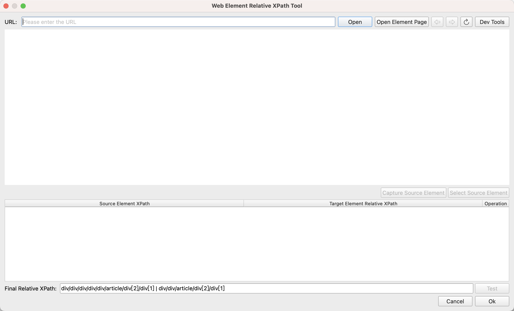

# Web Element Relative XPath Tool

In the [Get Relative Web Element](../commands/WebAutomation/WebElementOperation/get_relative_web_element.md) instruction, if you need to locate descendant elements, you must configure the relative XPath path of the descendant elements relative to the parent element. This tool allows you to quickly obtain the relative XPath path.

## Usage

Click the "Get Relative XPath" button in the instruction's configuration dialog to open this tool.

Enter the URL of the target webpage and click the "Open" button to load the target webpage.

Click the "Capture Source Element" button, then press Ctrl + Left Click to capture the source element.

Next, click the "Capture Target Element" button, then press Ctrl + Left Click to capture the target element.

Once the source and target elements are located, the tool will automatically generate the XPath expression of the target element relative to the source element.

Finally, click the "Adopt" button. The XPath expression will be filled into the instruction's configuration dialog, and the tool will close.