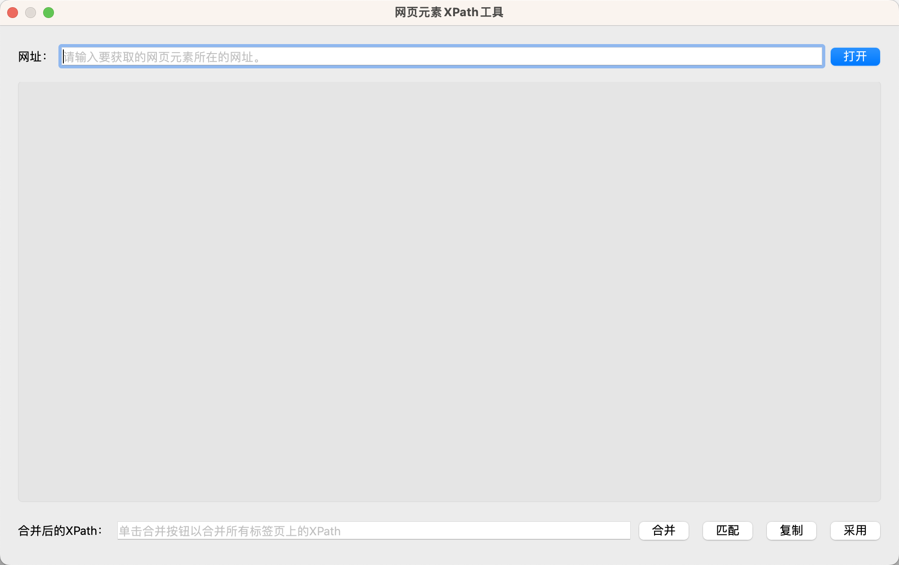
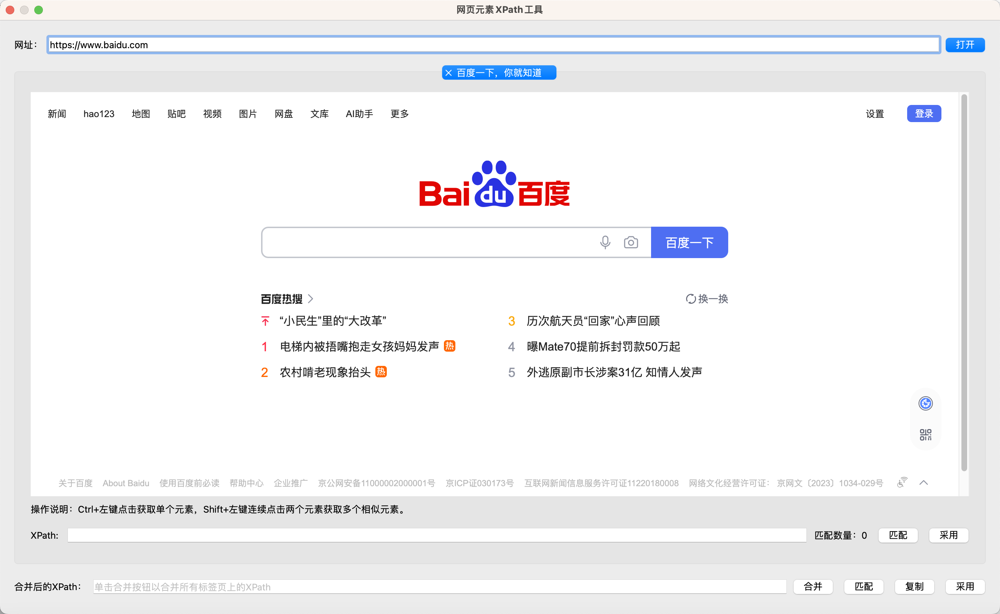
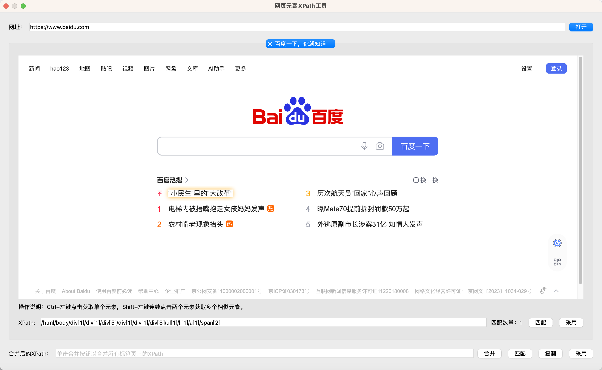
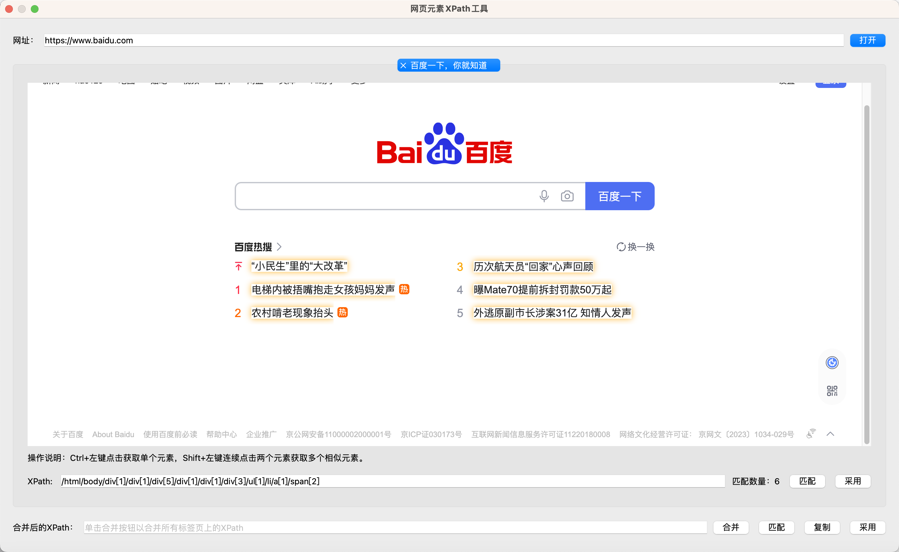
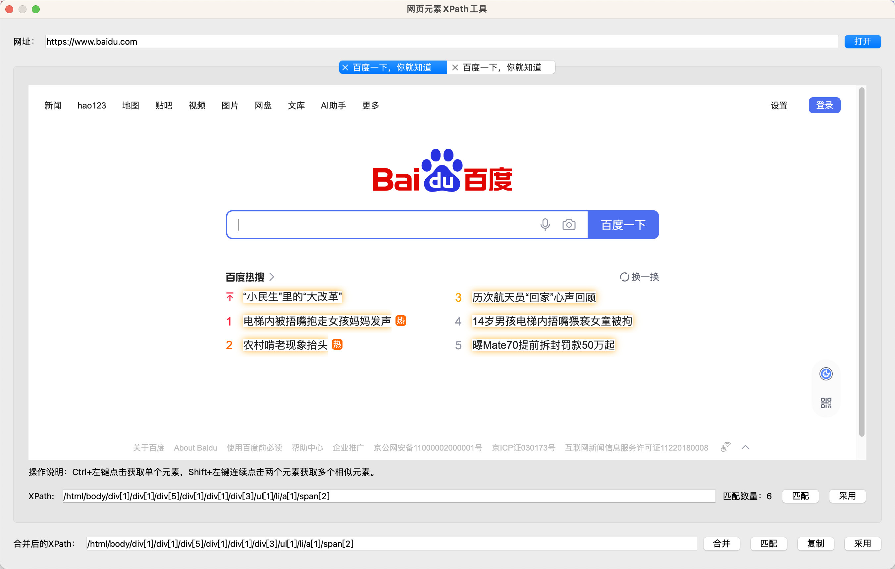

# Web Element XPath Tool

This tool is used to quickly locate web elements and generate XPath expressions.

## Basic Usage

Click the "Get XPath" button in the instruction configuration dialog to open this tool.

After opening, enter the URL of the web page containing the element in the URL box at the top, then click the "Open" button. The tool will open the web page as shown below:

Ctrl + left-click on the element you want to locate on the web page. The tool will highlight the selected element and automatically generate an XPath expression, as shown below:

To locate multiple elements, you can Shift + left-click on two elements consecutively. The tool will highlight all similar elements and automatically generate an XPath expression, as shown below:

After obtaining the desired XPath expression, click the "Adopt" button. The XPath expression will be filled into the instruction configuration dialog, and the tool will close.

If an XPath expression has already been configured in the instruction configuration dialog, the tool will automatically fill in that XPath expression when opened. After opening the URL, the user can click the "Match" button to highlight all matching elements.

## Merging XPath Expressions

Some web pages have dynamic structures where the position of elements changes with each load. In such cases, you can use the "Merge" feature to open multiple web pages simultaneously, locate the same element, and then merge the generated XPath expressions into a more general and adaptable XPath expression.

After entering the URL, you can click the "Open" button multiple times to open several web pages. Then, locate the elements on each web page as described earlier and generate the XPath expression for each page.

Next, click the "Merge" button at the bottom right. The tool will automatically merge all generated XPath expressions and create a more general XPath expression, as shown below:

After merging, you can click the "Match" button next to the "Merge" button to locate elements on the current page and check if the XPath expression matches the desired elements. You can switch between web pages to test.

Finally, you can click the "Copy" button to copy the merged XPath to the clipboard or click the "Adopt" button to use the merged XPath.

Note: The current merge function is relatively simple and can only merge elements with the same path. In other cases, it will only use the XPath union operator "|" for merging. Further optimizations will be made in the future.