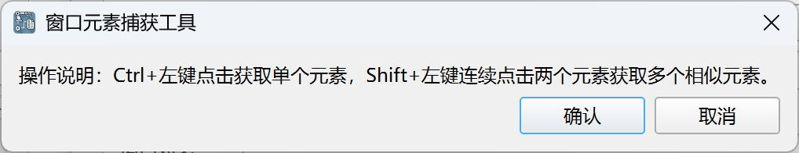
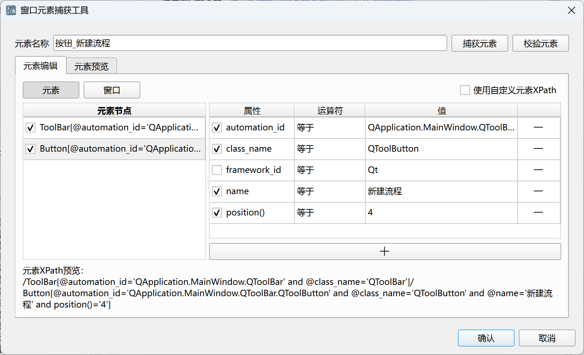
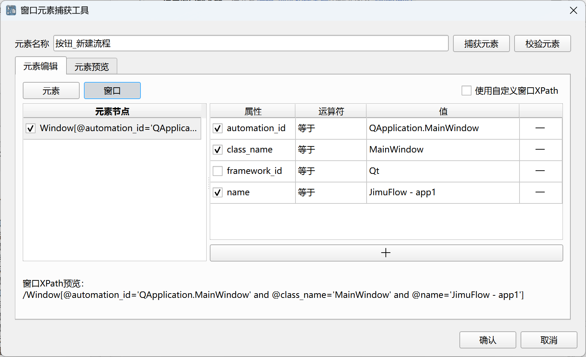
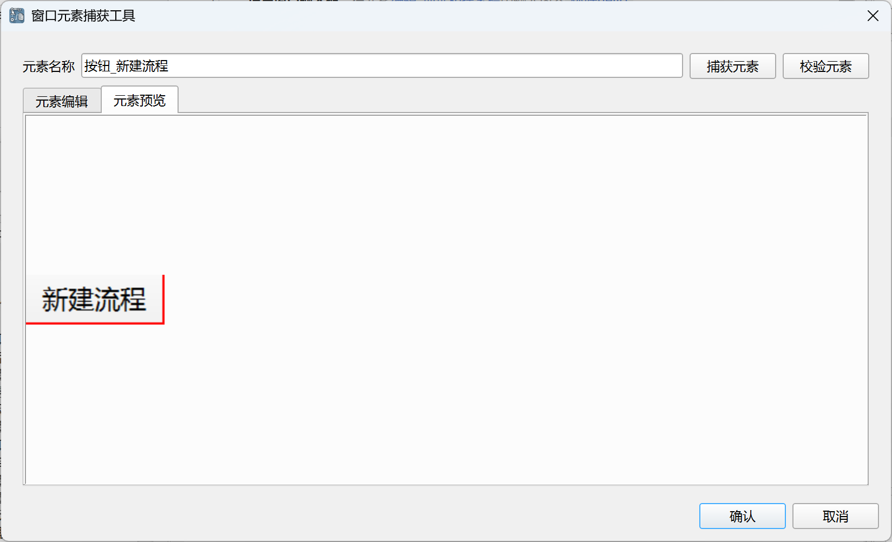

## Window Element Capture Tool

This tool is used to capture and edit window elements, which are then saved to the element library.

The capture interface is as follows:

Use Ctrl + left-click to capture a single element, and Shift + left-click on two elements consecutively to capture multiple similar elements.

After capturing, the following editing interface will be displayed:

The captured window elements are located using the window XPath path and the element XPath path. 
The window XPath path is used to locate the window object where the element resides,
and the element XPath path is used to locate the element object within the window object.

The editing interface will display the captured element's window XPath path and element XPath path, allowing users to adjust and edit them as needed.

Users can also click the "Capture Element" button to recapture the element, or click the "Validate Element" button to search and highlight matching elements in all current windows to verify the correctness of the element.

The element preview interface allows users to view a screenshot of the element, as shown below:

After editing, click the "Confirm" button to save the element to the element library. If needed, the element can be further edited in the element library later.