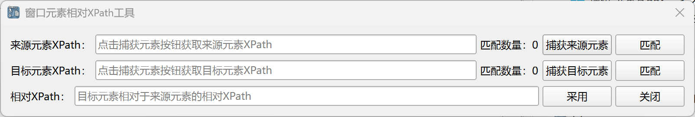

# Window Element Relative XPath Tool

In the [Get Relative Window Element](../commands/WindowsAutomation/WindowElementOperation/get_relative_window_element.md) instruction, if you need to locate descendant elements, you must configure the relative XPath path of the descendant elements relative to the parent element. This tool allows you to quickly obtain the relative XPath path.

## Usage

Click the "Get Relative XPath" button in the instruction's configuration dialog to open this tool.

Click the "Capture Source Element" button, then use Ctrl + left-click to capture the source element.

Next, click the "Capture Target Element" button, then use Ctrl + left-click to capture the target element.

After locating the source and target elements, the tool will automatically generate the XPath expression of the target element relative to the source element. Click the "Adopt" button, and the XPath expression will be filled into the instruction's configuration dialog, and the tool will close.