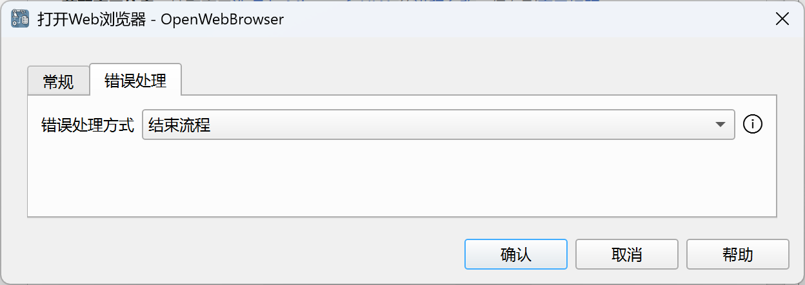
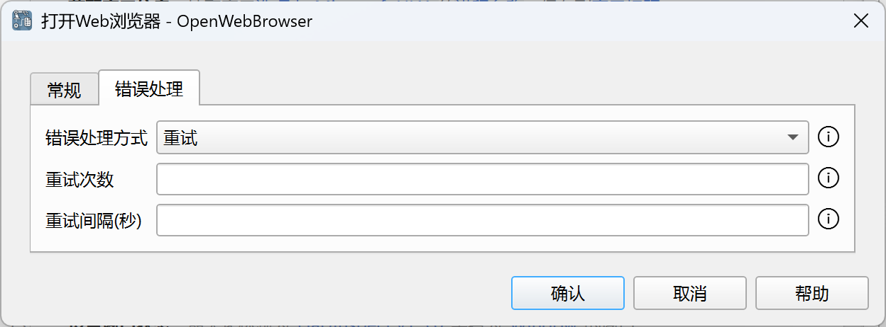
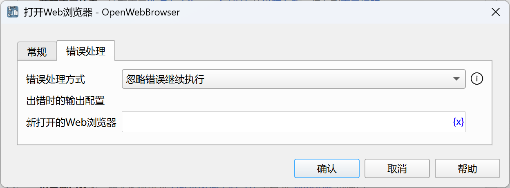

# 指令的错误处理

对于可能出错的指令，我们提供了通用的错误处理机制。

在指令的配置对话框中提供了错误处理相关的配置，如下所示：

### 错误处理方式

我们提供了三种错误处理方式：结束流程、重试或者忽略错误继续执行。

如果选择结束流程，则指令出错时将终止应用。

如果选择重试，系统将根据配置的重试次数和重试间隔进行重试，如果重试仍不成功，则终止应用。

如果选择忽略错误继续执行，则需要配置出错时的输出变量值，系统将把该指令的输出变量设置为该值，然后继续执行后续指令。
如果指令没有输出变量，则不需要配置。

### 重试次数

重试的次数。

### 重试间隔

重试的间隔时间，单位为秒。

### 出错时的输出配置

输入该指令输出变量的值。
