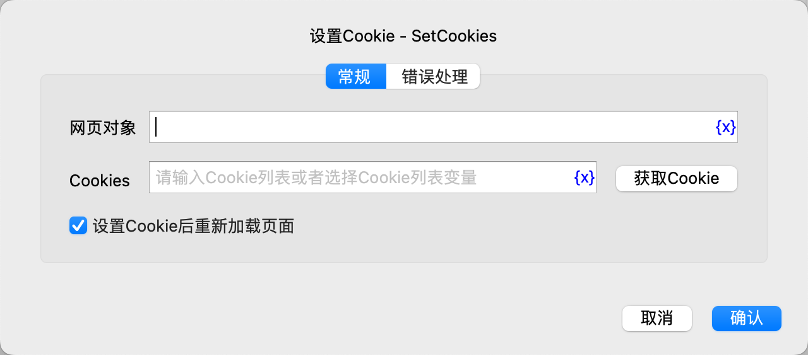
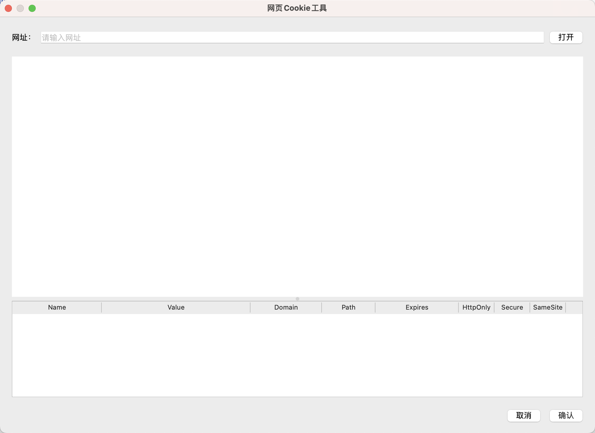
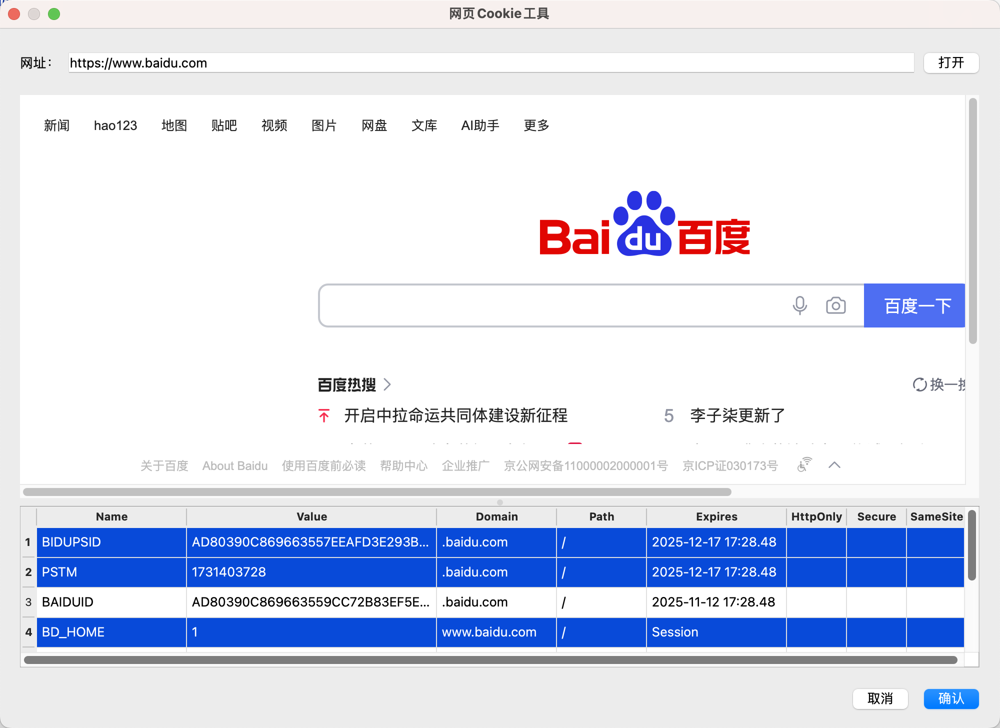

# 网页Cookie工具

在设置Cookie指令中，可以使用该工具获取网页Cookie。

## 使用方法

在指令的配置对话框中点击“获取Cookie”按钮，可以打开该工具。

打开之后，在上方的网址框中输入网址，然后点击“打开”按钮，工具将打开该网页，如下所示：

用户可以在网页上执行登录等操作，然后在Cookie列表中选择需要的Cookie，Ctrl+左键点击可以非连续多选，Shift+左键点击可以连续多选，
选择完之后，点击右下角的“确认”按钮返回指令对话框，选择的Cookie将自动填入指令中。

