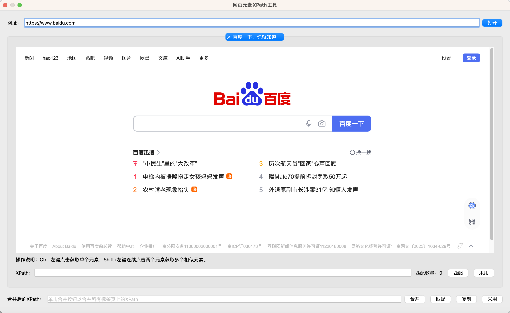

# 网页元素XPath工具

该工具用于快速定位网页元素，并生成XPath表达式。

## 基本使用方法

在指令的配置对话框中点击“获取XPath”按钮，可以打开该工具。

打开之后，在上方的网址框中输入网页元素所在的网址，然后点击“打开”按钮，工具将打开该网页，如下所示：

在网页上Ctrl+左键点击要定位的元素，工具将高亮显示选中的元素并自动生成XPath表达式，如下所示：

如果要定位多个元素，可以Shift+左键连续点击两个元素，工具将高亮显示所有相似元素并自动生成XPath表达式，如下所示：

获取到需要的XPath表达式后，点击“采用”按钮，该XPath表达式将被填入指令的配置对话框中，并且工具将关闭。

如果在指令的配置对话框中之前已经配置了XPath表达式，打开该工具时，该工具将自动填充该XPath表达式，用户在打开网址之后，
可以点击“匹配”按钮高亮显示所有匹配到的元素。

## 合并XPath表达式

有些网页的结构是动态的，每一次加载元素的位置都会发生变化，此时可以使用“合并”功能，同时打开多个网页，并定位到相同的元素，
然后将生成的XPath表达式合并成一个更通用适配性更强的XPath表达式。

输入网址后，可以多次点击“打开”按钮打开多个网页，然后在网页上按照之前方法定位元素，并生成每个网页上的XPath表达式。

然后点击右下角的“合并”按钮，工具将自动合并所有生成的XPath表达式，并生成一个更通用的XPath表达式，如下所示：

合并之后，可以点击“合并”按钮后的“匹配”按钮在当前页面中定位元素，检查该XPath表达式是否可以匹配我们需要的元素，可以切换网页进行测试。

最后可以点击“复制”按钮将合并后的XPath复制到剪贴板，或者点击“采用”按钮采用合并后的XPath。

注意：当前的合并功能还较为简单，只能合并路径相同的元素，其他情况，只会使用XPath的并集操作符“|”进行合并，后续将会继续优化。
