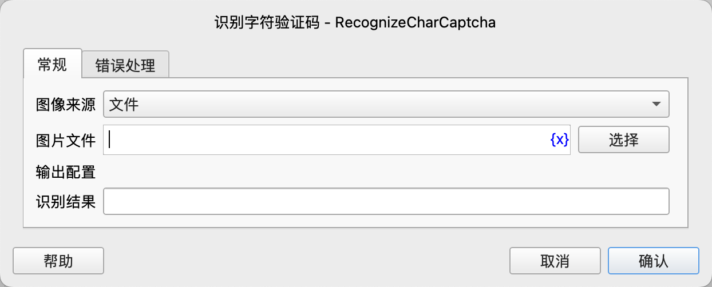
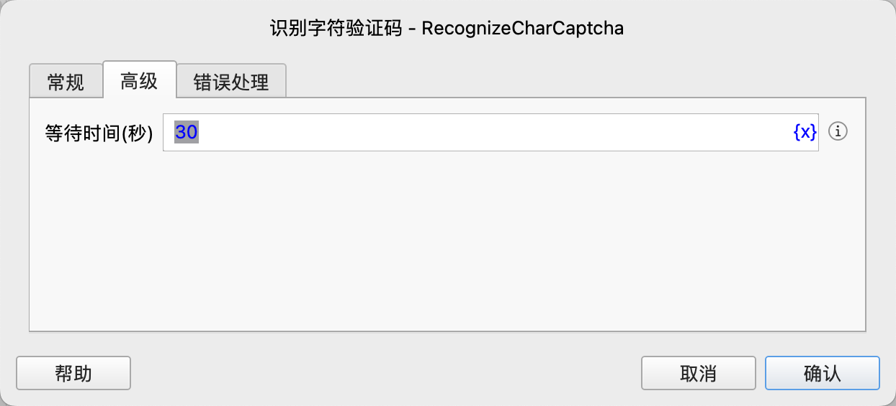

# 识别字符验证码

识别图片、网页或窗口中的字符验证码，并返回识别结果。

## 指令配置

### 图像来源

选择验证码图片的来源，可选值：文件、网页元素、窗口元素。

### 图片文件

当图像来源为"文件"时，输入验证码图片文件的路径。

### 网页对象

当图像来源为"网页元素"时，选择包含验证码的网页对象。

### 网页元素

当图像来源为"网页元素"时，从元素库中选择一个网页元素，或者点击“捕获元素”按钮调用工具获取，详情请参见[网页元素捕获工具](../../../manual/web_element_capture_tool.md)。

### 窗口元素

当图像来源为"窗口元素"时，选择窗口中验证码图片元素。

### 等待时间

等待网页元素或窗口元素出现的时间，单位为秒。

### 识别结果

输入用于保存识别结果的变量名。

### 错误处理

如果指令执行出错，则执行错误处理，详情参见[指令的错误处理](../../../manual/error_handling.md)。

## 注意事项

1. 该指令使用 ddddocr 库进行验证码识别，对于简单的字符验证码有较高的识别率，但对于复杂的验证码（如扭曲严重、有干扰线、背景复杂等）可能识别效果不佳。

2. 当图像来源为网页元素或窗口元素时，指令会先截取元素图像，然后进行识别。确保选择的元素正确包含了完整的验证码图片。

3. 等待时间参数仅在图像来源为网页元素或窗口元素时有效，用于等待元素出现。如果元素在指定时间内未出现，将抛出异常。

4. 如果识别失败或输入参数有误，指令将抛出异常，可以使用错误处理机制捕获并处理这些异常。
