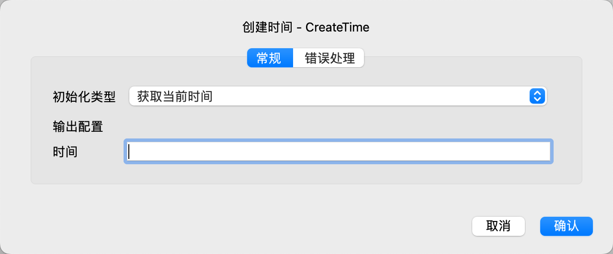

# 创建时间

创建一个时间变量，并初始化为指定的值。

## 指令配置

### 初始化类型

选择初始化类型，可选值有：获取当前时间、解析时间字符串。

### 时间字符串

如果初始化类型为解析时间字符串，则输入时间字符串。

### 时间格式

如果初始化类型为解析时间字符串，则输入时间格式。

关于时间格式的更多信息，请参考 [日期时间格式](create_date_time.md#_6)

### 时间

输入用于保存时间的变量名。
