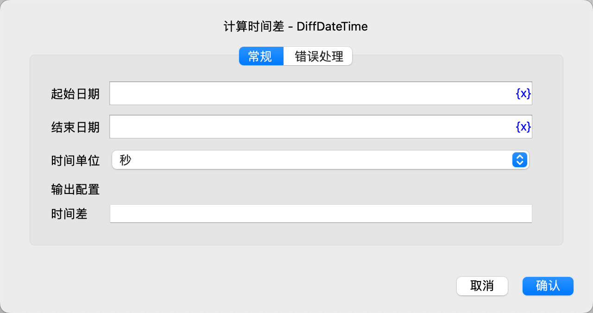

# 计算时间差

计算两个日期时间对象的时间差。

## 指令配置

### 起始日期

输入起始日期时间。

### 结束日期

输入结束日期时间。

### 时间单位

选择时间差单位，可选值有：秒、分钟、小时、天。

### 时间差

输入用于保存时间差的变量名。

计算的结果是一个整数，如果起始日期在结束日期之前，则返回正数；如果起始日期在结束日期之后，则返回负数，否则返回0。

### 错误处理

如果指令执行出错，则执行错误处理，详情参见[指令的错误处理](../../../manual/error_handling.md)。
