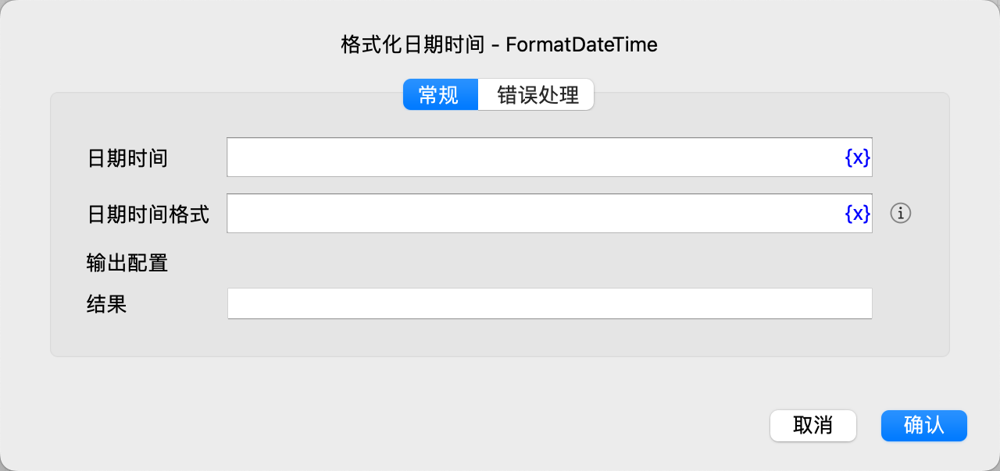

# 格式化日期时间

将日期时间对象按照指定的格式转为字符串。

## 指令配置

### 日期时间

选择日期时间对象。

### 日期时间格式

输入日期时间格式，详情参见 [日期时间格式](create_date_time.md#_6)。

### 结果

输入用于保存结果字符串的变量名。

### 错误处理

如果指令执行出错，则执行错误处理，详情参见[指令的错误处理](../../../manual/error_handling.md)。
