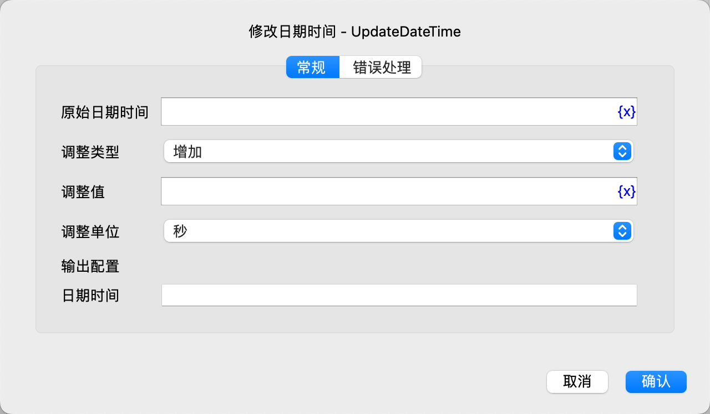

# 修改日期时间

修改日期时间。

## 指令配置

### 原始日期时间

输入需要修改的日期时间。

### 调整类型

选择调整类型，可选值有：增加、减少。

### 调整值

输入需要增加或减少的值。

### 调整单位

选择调整单位，可选值有：微秒、毫秒、秒、分钟、小时、天、周、月、年。

### 日期时间

输入用于保存调整后的日期时间的变量名。

### 错误处理

如果指令执行出错，则执行错误处理，详情参见[指令的错误处理](../../../manual/error_handling.md)。
