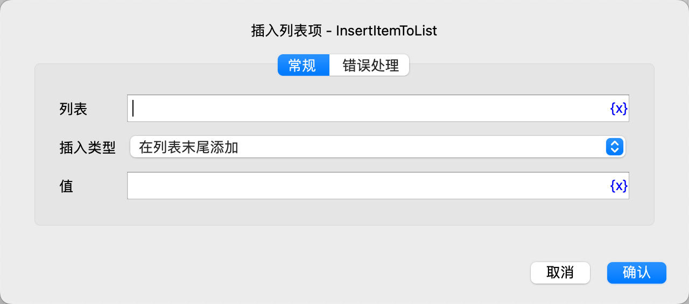

# 插入列表项

插入一个列表项。

## 指令配置

### 列表

选择列表对象。

### 插入类型

选择插入类型，可选值有：在列表末尾添加、在指定位置插入。

### 插入位置

如果选择了在指定位置插入，则需要输入插入位置，从 0 开始，-n 表示倒数第 n 个位置。

### 值

输入要插入的值。

### 错误处理

如果指令执行出错，则执行错误处理，详情参见[指令的错误处理](../../../manual/error_handling.md)。
