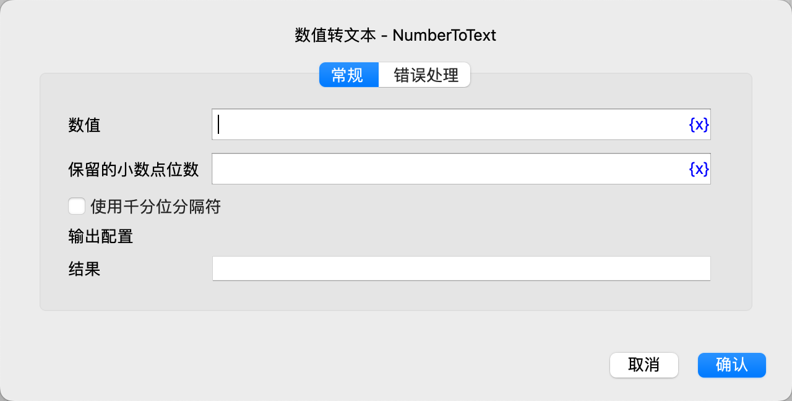

# 数值转文本

将数值转换为文本。

## 指令配置

### 数值

输入数值。

### 保留的小数点位数

输入保留的小数点位数，超过该位数的数字将被四舍五入。

### 使用千分位分隔符

选择是否使用千分位分隔符（英文逗号）。

### 结果

输入用于保存转换结果的变量名。

### 错误处理

如果指令执行出错，则执行错误处理，详情参见[指令的错误处理](../../../manual/error_handling.md)。
