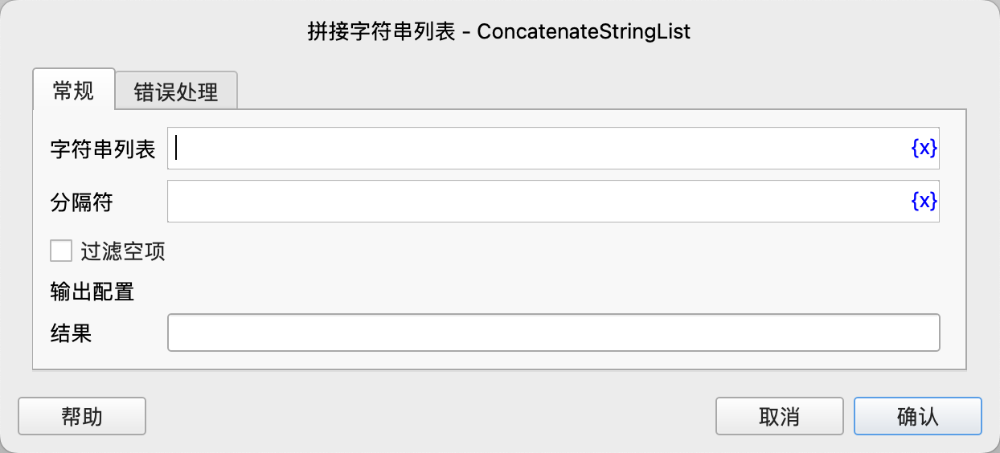

# 字符串列表拼接

将字符串列表中的元素拼接成一个字符串，可以指定分隔符。

## 指令配置

### 输入参数

- **字符串列表**：要拼接的字符串列表。
- **分隔符**：用于在拼接字符串之间插入的分隔符。如果不需要分隔符，可以留空。
- **过滤空项**：是否过滤掉空项。

### 输出参数

- **结果**：拼接后的字符串。

### 示例

### 示例1：使用空分隔符拼接字符串列表

输入：

- 字符串列表：["Hello", "World", "Test"]
- 分隔符：""（空字符串）

输出：

- 结果："HelloWorldTest"

### 示例2：使用空格分隔符拼接字符串列表

输入：

- 字符串列表：["Hello", "World", "Test"]
- 分隔符：" "（空格）

输出：

- 结果："Hello World Test"

### 示例3：使用逗号和空格分隔符拼接字符串列表

输入：

- 字符串列表：["Hello", "World", "Test"]
- 分隔符：", "（逗号加空格）

输出：

- 结果："Hello, World, Test"

### 错误处理

如果指令执行出错，则执行错误处理，详情参见[指令的错误处理](../../../manual/error_handling.md)。

## 注意事项

- 如果字符串列表为空，结果将是一个空字符串。
- 如果字符串列表中包含非字符串元素（如数字），它们会被自动转换为字符串后再进行拼接。
- 分隔符可以是任意字符串，包括空字符串。
