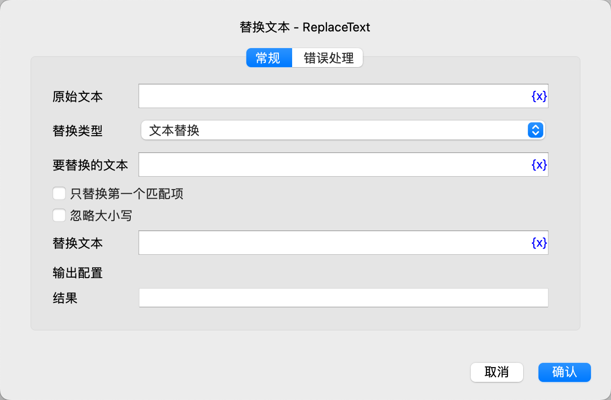

# 替换文本

将文本中的指定文本替换为另一个文本。

## 指令配置

### 原始文本

输入原始文本。

### 替换类型

选择替换类型，可选值为：文本替换、正则替换。

### 要替换的文本

如果选择了文本替换，则输入要替换的文本。

### 要替换的正则表达式

如果选择了正则替换，则输入要替换的正则表达式。

### 只替换第一个匹配项

选择是否只替换第一个匹配项。

### 忽略大小写

选择是否忽略大小写。

### 替换文本

输入要替换为的文本。

### 结果

输入用于保存替换后的文本的变量名。

### 错误处理

如果指令执行出错，则执行错误处理，详情参见[指令的错误处理](../../../manual/error_handling.md)。
