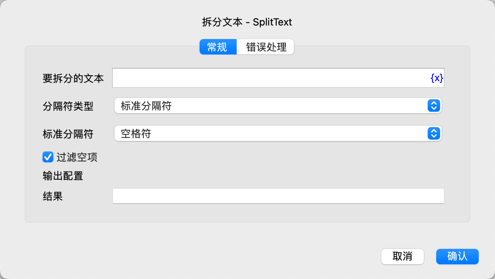

# 拆分文本

将文本按照指定的分隔符拆分成文本列表。

## 指令配置

### 要拆分的文本

输入要拆分的文本。

### 分隔符类型

选择分隔符类型，可选值为：标准分隔符、自定义分隔符。

### 标准分隔符

选择要使用的标准分隔符，可选值为：空格符、换行符、制表符。

### 自定义分隔符

如果选择了自定义分隔符，则输入自定义分隔符。

### 过滤空项

选择是否过滤掉拆分出来的空串。

### 使用正则表达式

如果选择了自定义分隔符，则选择是否需要将自定义分隔符作为正则表达式。

### 结果

输入用于保存拆分出来的文本列表的变量名。

### 错误处理

如果指令执行出错，则执行错误处理，详情参见[指令的错误处理](../../../manual/error_handling.md)。
