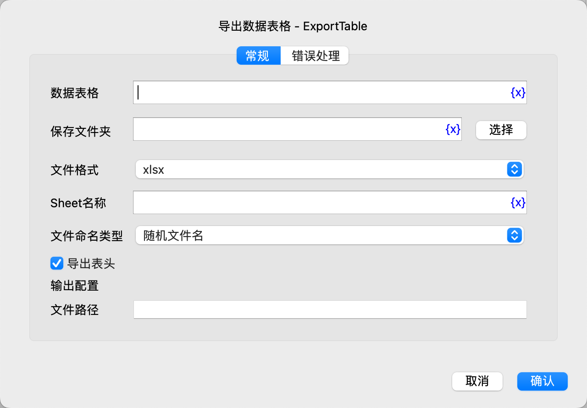

# 导出数据表格

将数据表格导出为本地文件。

## 指令配置

### 数据表格

选择要导出的数据表格。

### 保存文件夹

输入或选择保存文件夹的路径。

### 文件格式

选择导出的文件格式，可选项有：xlsx、xls、csv。

### Sheet名称

如果导出为xlsx或xls，则需要输入Sheet名称。

### 使用自定义分隔符

如果导出为csv，则可以选择是否使用自定义分隔符。

### 自定义分隔符

输入csv文件的自定义分隔符。

### 文件命名类型

选择文件命名类型，可选项有：随机文件名、自定义文件名。

### 自定义文件名

如果选择了自定义文件名，则输入自定义文件名，不需要输入文件扩展名。

### 覆盖现有文件

如果选择自定义文件名，则可以选择是否覆盖同名文件。

### 导出表头

选择是否导出表头。

### 文件路径

输入用于保存导出文件路径的变量名。

### 错误处理

如果指令执行出错，则执行错误处理，详情参见[指令的错误处理](../../manual/error_handling.md)。
