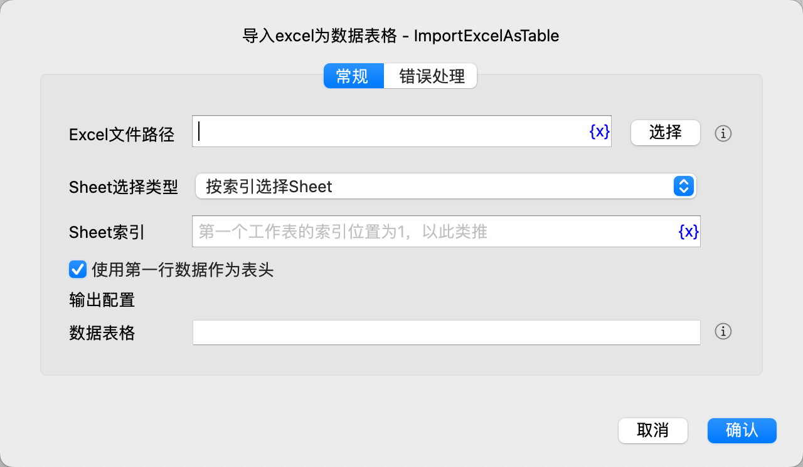

# 导入excel为数据表格

将excel工作表导入为数据表格。

## 指令配置

### Excel文件路径

输入或选择Excel文件路径，支持.xls或.xlsx文件。

### Sheet选择类型

选择Sheet选择类型，可选项有：按索引选择Sheet、按名称选择Sheet。

### Sheet索引

如果选择按索引选择Sheet，则输入Sheet索引，从1开始。

### Sheet名称

如果选择按名称选择Sheet，则输入Sheet名称。

### 使用第一行数据作为表头

选择是否使用第一行数据作为表头。

### 数据表格

输入用于保存数据表格的变量名。

### 错误处理

如果指令执行出错，则执行错误处理，详情参见[指令的错误处理](../../manual/error_handling.md)。
