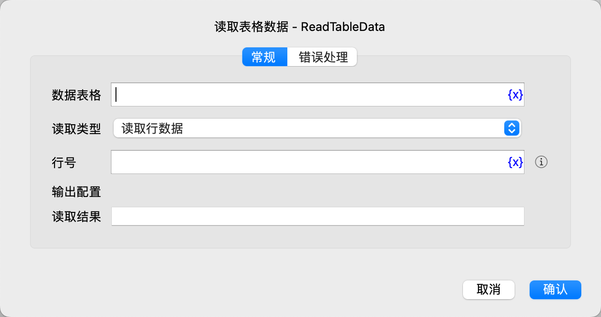

# 读取表格数据

读取数据表格的一行或单元格数据。

## 指令配置

### 数据表格

选择要读取的数据表格。

### 读取类型

选择读取类型，可选项有：读取行数据、读取单元格数据。

### 行号

输入要读取的行号，从1开始，-n表示倒数第n行。

### 列号

如果读取单元格数据，则需要输入单元格的列号，从1开始，-n表示倒数第n列。

### 读取结果

输入用于保存读取结果的变量名。

### 错误处理

如果指令执行出错，则执行错误处理，详情参见[指令的错误处理](../../manual/error_handling.md)。
