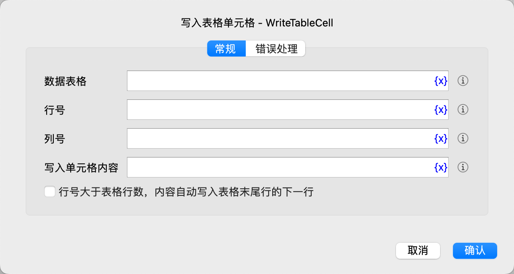

# 写入表格单元格

向数据表格中写入单元格数据。

## 指令配置

### 数据表格

选择要操作的数据表格。

### 行号

输入单元格的行号，从1开始，-n表示倒数第n行。

### 列号

输入单元格的列号，从1开始，-n表示倒数第n列。

### 写入单元格内容

输入要写入的单元格的内容。

### 行号大于表格行数，内容自动写入表格末尾行的下一行

勾选后，当输入的行号大于表格行数时，会将输入的内容写入表格末尾行的下一行。

### 错误处理

如果指令执行出错，则执行错误处理，详情参见[指令的错误处理](../../manual/error_handling.md)。
