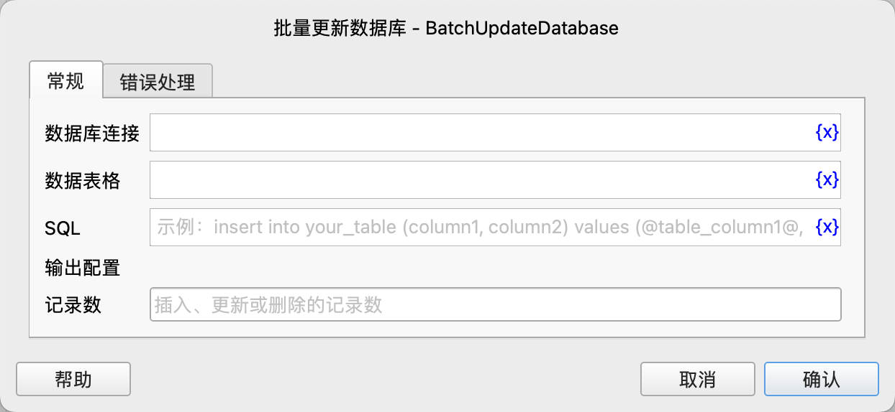

# 批量更新数据库

基于表格数据和带占位符的SQL语句，批量更新数据库，将影响的行数保存到变量中。

## 指令配置

### 数据库连接

选择要执行SQL语句的数据库连接对象。

### 数据表格

选择要作为SQL语句的输入的数据表格对象。

### SQL

输入要执行的SQL语句, 其中可以包含占位符，占位符的格式为`@数据表格列名@`。

执行时，指令将逐行读取数据表格中的数据，并替换占位符，然后执行SQL语句。

### 记录数

指令执行成功后，将受影响的行数保存到该变量中。

### 错误处理

如果指令执行出错，则执行错误处理，详情参见[指令的错误处理](../../manual/error_handling.md)。
