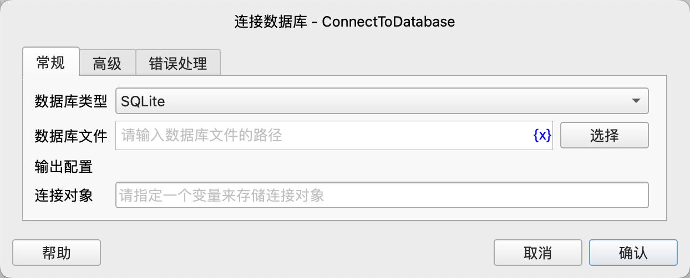
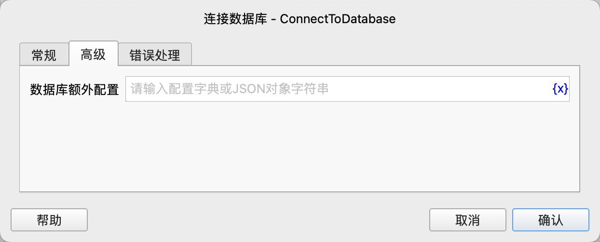

# 连接数据库

创建一个到数据库的连接，并将连接对象保存到变量中。

## 指令配置

### 数据库类型

选择连接的目标数据库类型，目前支持以下数据库类型：

- SQLite：SQLite数据库
- MySQL：MySQL数据库
- SQL Server：SQL Server数据库
- PostgreSQL：PostgreSQL数据库

### 数据库文件

如果选择了SQLite数据库，则需要指定数据库文件的路径。

### 数据库主机名

如果选择了MySQL、SQL Server或PostgreSQL数据库，则需要指定数据库的主机名。

### 数据库端口

如果选择了MySQL、SQL Server或PostgreSQL数据库，则可以指定数据库的端口号，如果不指定，则使用默认端口号。

各个数据库的默认端口如下：

| 数据库类型 | 默认端口号 |
| --- | --- |
| MySQL | 3306 |
| SQL Server | 1433 |
| PostgreSQL | 5432 |

### 数据库名称

如果选择了MySQL、SQL Server或PostgreSQL数据库，则可以指定数据库的名称。

### 数据库用户名

对于MySQL、SQL Server或PostgreSQL数据库，如果需要进行身份验证，则需要指定数据库的用户名。

### 数据库密码

对于MySQL、SQL Server或PostgreSQL数据库，如果需要进行身份验证，则需要指定数据库的密码。

### 数据库额外配置

通过额外配置，可以指定一些额外的数据库连接参数，这些参数会传递给数据库的连接函数。

SQLite数据库的常用配置如下：

| 参数名 | 参数类型 | 默认值   | 说明                                                                                                               |
| --- |------|-------|------------------------------------------------------------------------------------------------------------------|
| timeout | 小数   | 5     | 当表被锁定时，连接在抛出 OperationalError 前应等待的秒数。若其他连接开启事务修改表，该表将被锁定直到事务提交。默认5秒。                                            |

完整的SQLite配置参数请参见：[SQLite3连接参数](https://docs.python.org/3/library/sqlite3.html#sqlite3.connect)。

MySQL数据库的常用配置如下：

| 参数名 | 参数类型 | 默认值                    | 说明                                               |
| --- |------|------------------------|--------------------------------------------------|
| use_unicode | 布尔值 | true                   | 是否使用Unicode。                                     |
| charset | 字符串 | utf8mb4                | 要使用哪个MySQL字符集。                                   |
| collation | 字符串 | utf8mb4_general_ai_ci  | 要使用哪个MySQL排序规则。                                  |
| time_zone | 字符串 |                        | 要使用哪个MySQL时区。                                    |
| connection_timeout | 整数 |                        | 连接超时时间，单位为秒。                                     |
| read_timeout | 整数 | 默认不限制                  | 读取超时时间，单位为秒。                                     |
| write_timeout | 整数 | 默认不限制                  | 写入超时时间，单位为秒。                                     |
| ssl_ca | 字符串 |                        | 包含SSL证书颁发机构的文件。                                  |
| ssl_cert | 字符串 |                        | 包含SSL证书的文件。                                      |
| ssl_disabled | 布尔值 | false                  | 是否禁用SSL连接。                                       |
| ssl_key | 字符串 |                        | 包含SSL证书私钥的文件。                                    |
| ssl_verify_cert | 布尔值 | false                  | 当设置为true时，将根据ssl_ca选项指定的证书文件检查服务器证书。任何不匹配都会导致报错。 |
| ssl_verify_identity | 布尔值 | false                  | 当设置为true时，将验证服务器证书的公用名称（CN）或主题 Alternative Name（SAN）是否与主机名匹配。 |

完整的MySQL配置参数请参见：[MySQL连接参数](https://dev.mysql.com/doc/connector-python/en/connector-python-connectargs.html)。

SQL Server数据库的常用配置如下：

| 参数名 | 参数类型 | 默认值 | 说明 |
| --- |------|-----|----|
| timeout | 整数 | 0   | 查询超时（秒），默认值0（无超时） |
| login_timeout | 整数 | 0   | 连接和登录超时（秒），默认值60 |
| charset | 字符串 |  | 用于连接到数据库的字符集 |
| read_only | 布尔值 | false | 连接时是否以只读模式打开 |

完整的SQL Server配置参数请参见：[SQL Server连接参数](https://pymssql.readthedocs.io/en/stable/ref/pymssql.html#functions)。

PostgreSQL数据库的常用配置如下：

| 参数名 | 参数类型 | 默认值 | 说明 |
| --- |------|-----|----|
| connect_timeout | 整数 |  | 连接时等待的最长时间，以秒为单位。零、负数或未指定表示无限期等待。 |
| client_encoding | 字符串 |  | 客户端字符集 |
| tcp_user_timeout | 整数 |  | 控制在强制关闭连接之前，传输的数据可能保持未确认的毫秒数。零值使用系统默认值。 |

完整的PostgreSQL配置参数请参见：[PostgreSQL连接参数](https://www.postgresql.org/docs/current/libpq-connect.html#LIBPQ-PARAMKEYWORDS)。

### 连接对象

输入用于保存连接对象的变量名。

### 错误处理

如果指令执行出错，则执行错误处理，详情参见[指令的错误处理](../../manual/error_handling.md)。
