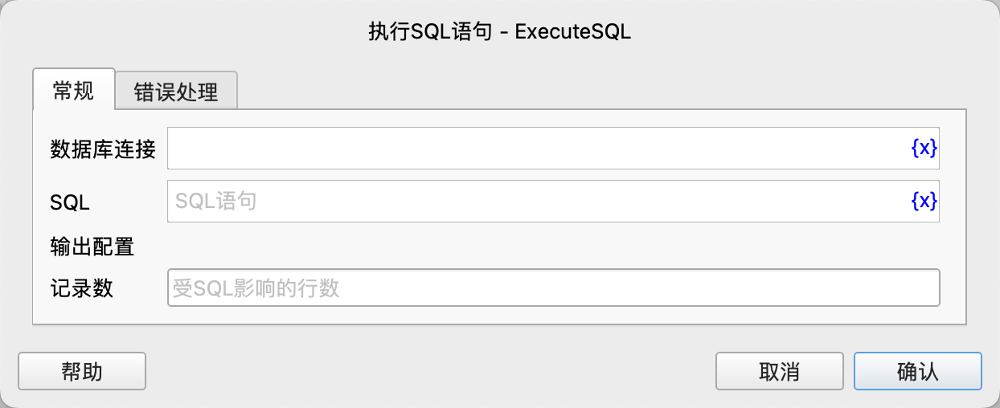

# 执行SQL语句

在目标数据库中执行insert、update、delete等SQL语句，并将受影响的行数保存到变量中。

## 指令配置

### 数据库连接

选择要执行SQL语句的数据库连接对象。

### SQL

输入要执行的SQL语句。

### 记录数

指令执行成功后，将受影响的行数保存到该变量中。

### 错误处理

如果指令执行出错，则执行错误处理，详情参见[指令的错误处理](../../manual/error_handling.md)。
