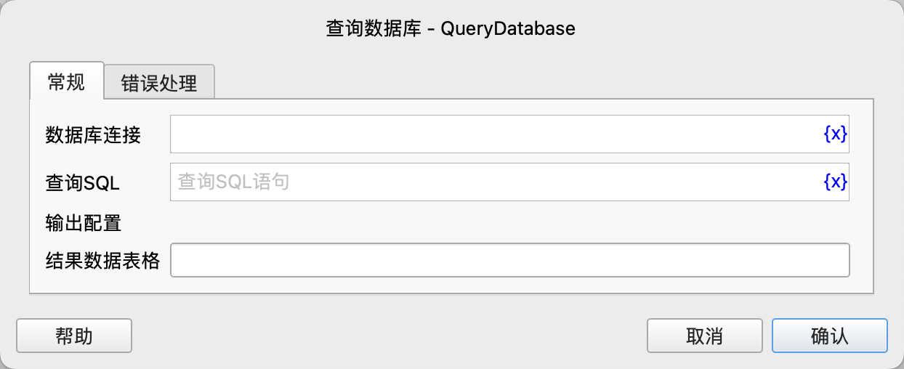

# 查询数据库

在目标数据库中执行SQL查询语句，将查询结果保存到变量中。

## 指令配置

### 数据库连接

选择要执行SQL语句的数据库连接对象。

### 查询SQL

输入要执行的SQL查询语句。

### 结果数据表格

输入用于保存查询结果的数据表格类型的变量名。

### 错误处理

如果指令执行出错，则执行错误处理，详情参见[指令的错误处理](../../manual/error_handling.md)。
