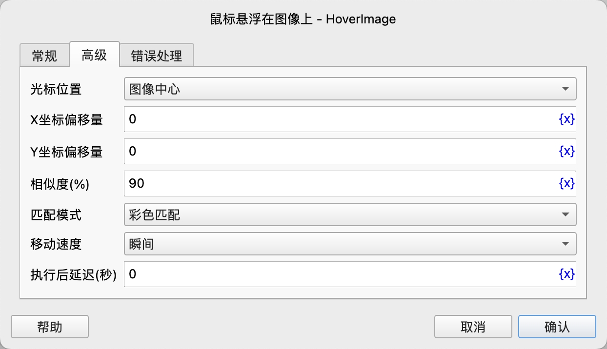

# 鼠标悬浮在图像上

在屏幕上查找图像，并将鼠标移动到图像上。

## 指令配置

### 图像

点击“选择资源”按钮从资源库中选择要查找的图像文件，或者点击“截图”按钮，使用屏幕截图工具截图。

请确保截图的分辨率和系统的屏幕分辨率一致，否则会导致定位失败。

### 光标位置

选择要移动到的光标位置，可选值有：图像中心、图像左上角，默认图像中心。

### X坐标偏移量

填写X坐标偏移量，正数向右移动，负数向左移动，默认为0。

### Y坐标偏移量

填写Y坐标偏移量，正数向下移动，负数向上移动，默认为0。

### 相似度(%)

填写图像匹配相似度百分比，取值范围0到100，默认为90。

### 匹配模式

选择匹配模式，可选值有：彩色匹配、灰度匹配。

### 移动速度

选择鼠标移动速度，可选值有瞬间、快速、中速、慢速。

### 执行后延迟

执行指令后，延迟一段时间再继续执行后续指令，单位为秒。

### 错误处理

如果指令执行出错，则执行错误处理，详情参见[指令的错误处理](../../manual/error_handling.md)。
