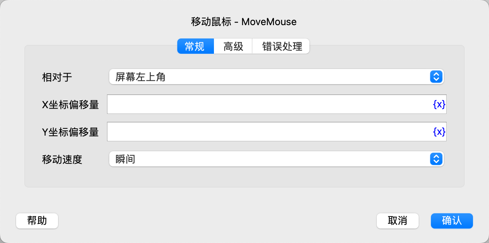
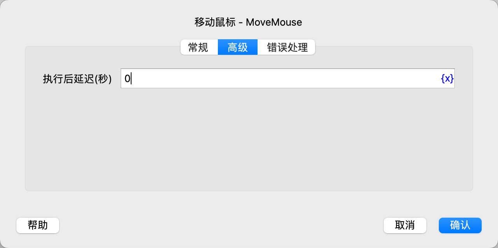

# 移动鼠标

将鼠标移动到指定位置。

## 指令配置

### 相对于

选择相对于屏幕左上角或者当前鼠标位置移动鼠标。

### X坐标偏移量

填写X坐标偏移量，正数向右移动，负数向左移动。

### Y坐标偏移量

填写Y坐标偏移量，正数向下移动，负数向上移动。

### 移动速度

选择移动速度，可选值有瞬间、快速、中速、慢速。

### 执行后延迟

执行指令后，延迟一段时间再继续执行后续指令，单位为秒。

### 错误处理

如果指令执行出错，则执行错误处理，详情参见[指令的错误处理](../../manual/error_handling.md)。
