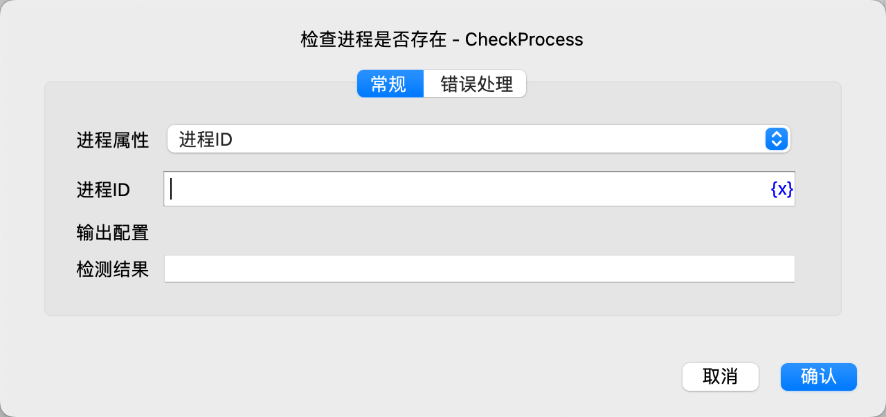

# 检查进程是否存在

检查操作系统上的进程是否存在。

## 指令配置

### 进程属性

选择根据哪个属性查找进程，可选项有：进程ID、进程名称。

### 进程ID

填写要检查的进程ID。

### 进程名称

填写要检查的进程名称。

### 检查结果

输入用于保存检查结果的变量名称，如果进程存在，则变量值为true，否则为false。

### 错误处理

如果指令执行出错，则执行错误处理，详情参见[指令的错误处理](../../manual/error_handling.md)。
